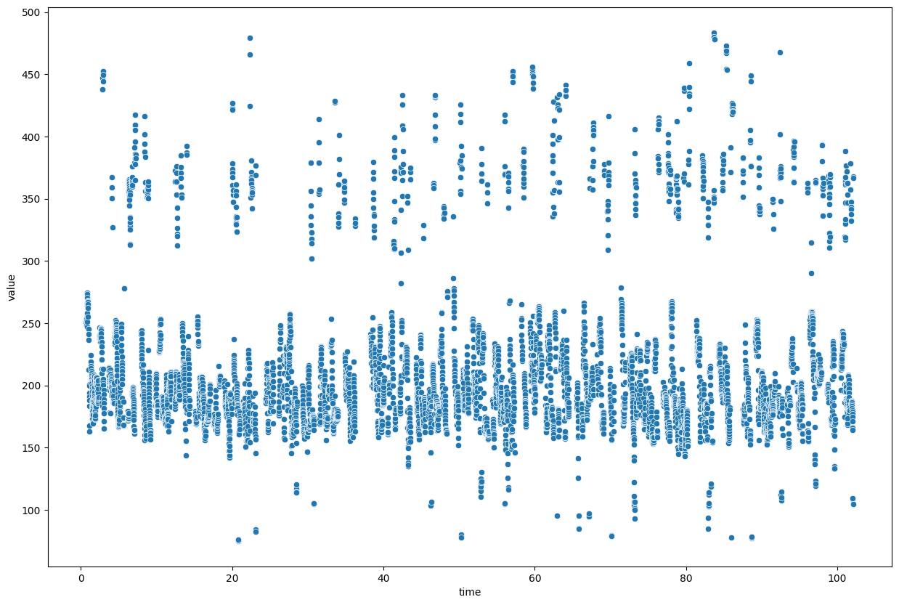

# PyTiers
A pythonic way to deal with Praat's tier items.
PyTiers is a python package that allows you to read, write, manipulate, and visulaize Praat PitchTiers and DurationTiers.

## Installation
```
pip install pytiers
```


```python
import pytiers as pyt
from pytiers import parameters, by
```

### Read PitchTier


```python
pt = pyt.read_tier('demo_data/demo.PitchTier')
```

### Get first 10 points


```python
pt[:10]
```


    [Point[1](time=0.6916666666666658, value=251.1239495891874),
     Point[2](time=0.7016666666666658, value=252.44049383098044),
     Point[3](time=0.7116666666666658, value=252.9173724758031),
     Point[4](time=0.7216666666666658, value=252.43241443363095),
     Point[5](time=0.7316666666666657, value=252.0881696843589),
     Point[6](time=0.7416666666666657, value=252.27266855152342),
     Point[7](time=0.7516666666666657, value=253.24763154144037),
     Point[8](time=0.7616666666666657, value=253.52590107673126),
     Point[9](time=0.7716666666666657, value=251.51992392003504),
     Point[10](time=0.7816666666666657, value=248.1101529518708)]


### Get point

#### Get nearest point by time


```python
pt.get_point(1, by=by.TIME, strict=False)
```


    Point[32](time=1.0016666666666656, value=241.0621128930537)


#### Get point by index


```python
pt.get_point(30, by=by.INDEX)
```


    Point[30](time=0.9816666666666657, value=245.41827910799626)


### Get points

#### Get points between two indices


```python
pt.get_points((25, 30), by=by.INDEX)
```


    [Point[25](time=0.9316666666666658, value=267.4230299089029),
     Point[26](time=0.9416666666666658, value=266.60008314559127),
     Point[27](time=0.9516666666666658, value=264.84054480946844),
     Point[28](time=0.9616666666666658, value=261.9267821109761),
     Point[29](time=0.9716666666666658, value=255.23190926027488),
     Point[30](time=0.9816666666666657, value=245.41827910799626)]


#### Get points between two points


```python
p1 = pt.get_point(25, by=by.INDEX)
p2 = pt.get_point(30, by=by.INDEX)
pt.get_points((p1.point_index, p2.point_index), by=by.INDEX)
```


    [Point[25](time=0.9316666666666658, value=267.4230299089029),
     Point[26](time=0.9416666666666658, value=266.60008314559127),
     Point[27](time=0.9516666666666658, value=264.84054480946844),
     Point[28](time=0.9616666666666658, value=261.9267821109761),
     Point[29](time=0.9716666666666658, value=255.23190926027488),
     Point[30](time=0.9816666666666657, value=245.41827910799626)]


#### Get points between two time points


```python
pt.get_points((1, 1.2), by=by.TIME)
```


    [Point[32](time=1.0016666666666656, value=241.0621128930537),
     Point[33](time=1.0716666666666657, value=212.33672284905182),
     Point[34](time=1.0816666666666657, value=200.67829192385588),
     Point[35](time=1.0916666666666657, value=194.16760800689113),
     Point[36](time=1.1016666666666657, value=191.06725871396833),
     Point[37](time=1.1116666666666657, value=188.3035543677083),
     Point[38](time=1.1216666666666657, value=183.4968842869545),
     Point[39](time=1.1316666666666657, value=167.80906300947834),
     Point[40](time=1.1416666666666657, value=162.70691449134793)]


### Append point


```python
pt.add_point(pyt.Point(time=1.11, value=200))
pt.get_points((1, 1.2), by=by.TIME)
```


    [Point[32](time=1.0016666666666656, value=241.0621128930537),
     Point[33](time=1.0716666666666657, value=212.33672284905182),
     Point[34](time=1.0816666666666657, value=200.67829192385588),
     Point[35](time=1.0916666666666657, value=194.16760800689113),
     Point[36](time=1.1016666666666657, value=191.06725871396833),
     Point[37](time=1.11, value=200),
     Point[38](time=1.1116666666666657, value=188.3035543677083),
     Point[39](time=1.1216666666666657, value=183.4968842869545),
     Point[40](time=1.1316666666666657, value=167.80906300947834),
     Point[41](time=1.1416666666666657, value=162.70691449134793)]


### Convert to dataframe


```python
pt.to_dataframe()
```


<div>
<style scoped>
    .dataframe tbody tr th:only-of-type {
        vertical-align: middle;
    }

    .dataframe tbody tr th {
        vertical-align: top;
    }

    .dataframe thead th {
        text-align: right;
    }
</style>
<table border="1" class="dataframe">
  <thead>
    <tr style="text-align: right;">
      <th></th>
      <th>index</th>
      <th>time</th>
      <th>value</th>
    </tr>
  </thead>
  <tbody>
    <tr>
      <th>0</th>
      <td>1</td>
      <td>0.691667</td>
      <td>251.123950</td>
    </tr>
    <tr>
      <th>0</th>
      <td>2</td>
      <td>0.701667</td>
      <td>252.440494</td>
    </tr>
    <tr>
      <th>0</th>
      <td>3</td>
      <td>0.711667</td>
      <td>252.917372</td>
    </tr>
    <tr>
      <th>0</th>
      <td>4</td>
      <td>0.721667</td>
      <td>252.432414</td>
    </tr>
    <tr>
      <th>0</th>
      <td>5</td>
      <td>0.731667</td>
      <td>252.088170</td>
    </tr>
    <tr>
      <th>...</th>
      <td>...</td>
      <td>...</td>
      <td>...</td>
    </tr>
    <tr>
      <th>0</th>
      <td>5489</td>
      <td>102.041667</td>
      <td>108.972834</td>
    </tr>
    <tr>
      <th>0</th>
      <td>5490</td>
      <td>102.051667</td>
      <td>109.298668</td>
    </tr>
    <tr>
      <th>0</th>
      <td>5491</td>
      <td>102.061667</td>
      <td>104.503082</td>
    </tr>
    <tr>
      <th>0</th>
      <td>5492</td>
      <td>102.121667</td>
      <td>367.698449</td>
    </tr>
    <tr>
      <th>0</th>
      <td>5493</td>
      <td>102.131667</td>
      <td>366.882131</td>
    </tr>
  </tbody>
</table>
<p>5493 rows × 3 columns</p>
</div>


### Convert to plot


```python
pt.to_plot()
```


    <Axes: xlabel='time', ylabel='value'>


    

    


You can also use Plotly.


```python
parameters['to_plot.package'] = 'plotly'
pt.to_plot()
```


### Write to file


```python
pt.write_to_file('demo_data/demo_modified.PitchTier')
```

### Read DurationTier


```python
dt = pyt.read_tier('demo_data/demo.DurationTier')
dt
```


    DurationTier(name=demo, start_time=0.0, end_time=103.25333333333333, duration=103.25333333333333, points=[Point[1](time=15.922818410128954, value=1.928128544596358), Point[2](time=47.466551184790944, value=0.7290640131233914), Point[3](time=73.8901418279136, value=2.0710939310412115)])


