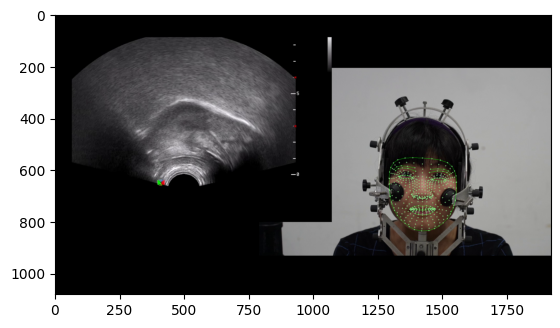

# About MediaPipe

[**MediaPipe**](https://developers.google.com/mediapipe) is an open-source framework developed by Google that provides a set of tools and machine learning models for building applications involving real-time perception of human gestures, poses, and other objects from video or camera input. It was created to make it easier for developers to build applications that can understand and interpret the visual world in real-time.

MediaPipe offers a range of pre-trained models and pipelines for tasks such as:

1. **Hand Tracking:** Detecting and tracking the movement and position of hands in videos or camera feeds.

2. **Face Detection and Recognition:** Identifying and tracking faces, recognizing facial landmarks, and even estimating facial expressions.

3. **Pose Estimation:** Estimating the 2D and 3D pose of a person or object within the camera view. This can be used for applications like fitness tracking, dance recognition, and more.

<p align="center">

</p>

MediaPipe provides pre-trained models and inference pipelines that can be easily integrated into various applications, including mobile apps, desktop software, web applications, and more. It also supports a variety of platforms, including Android, iOS, Windows, Linux, and macOS.

Developers can use the MediaPipe framework along with their preferred programming languages (such as Python, C++, or JavaScript) to create custom applications that leverage real-time visual perception and understanding. It has gained popularity in fields like computer vision, augmented reality, virtual reality, and human-computer interaction due to its flexibility and ease of use.


```python
# Install the dependencies:
# !pip install -r requirements.txt
```


```python
from utils import *
```


```python
video_path = "demo_data/demo.mov"

tf = TraceFace(video_path, data_file_name="demo_data/results")
```

    INFO: Created TensorFlow Lite XNNPACK delegate for CPU.


```python
tf.trace(start_frame=0, end_frame=10)
```

    100%|██████████| 10/10 [00:01<00:00,  9.20it/s]


```python
# after tracing, the results are now saved in `demo_data/results.csv`
import pandas as pd
df = pd.read_csv("demo_data/results.csv", index_col=0)
df.head(10)
```


<div>
<style scoped>
    .dataframe tbody tr th:only-of-type {
        vertical-align: middle;
    }

    .dataframe tbody tr th {
        vertical-align: top;
    }

    .dataframe thead th {
        text-align: right;
    }
</style>
<table border="1" class="dataframe">
  <thead>
    <tr style="text-align: right;">
      <th></th>
      <th>frame</th>
      <th>landmark</th>
      <th>x</th>
      <th>y</th>
      <th>z</th>
    </tr>
  </thead>
  <tbody>
    <tr>
      <th>0</th>
      <td>0</td>
      <td>0</td>
      <td>-0.000126</td>
      <td>-0.009231</td>
      <td>-0.017112</td>
    </tr>
    <tr>
      <th>1</th>
      <td>0</td>
      <td>1</td>
      <td>-0.001188</td>
      <td>-0.044133</td>
      <td>-0.032660</td>
    </tr>
    <tr>
      <th>2</th>
      <td>0</td>
      <td>2</td>
      <td>-0.000627</td>
      <td>-0.034365</td>
      <td>-0.017002</td>
    </tr>
    <tr>
      <th>3</th>
      <td>0</td>
      <td>3</td>
      <td>-0.006610</td>
      <td>-0.080028</td>
      <td>-0.025318</td>
    </tr>
    <tr>
      <th>4</th>
      <td>0</td>
      <td>4</td>
      <td>-0.001224</td>
      <td>-0.054752</td>
      <td>-0.034936</td>
    </tr>
    <tr>
      <th>5</th>
      <td>0</td>
      <td>5</td>
      <td>-0.001166</td>
      <td>-0.069032</td>
      <td>-0.032809</td>
    </tr>
    <tr>
      <th>6</th>
      <td>0</td>
      <td>6</td>
      <td>-0.000829</td>
      <td>-0.103190</td>
      <td>-0.017263</td>
    </tr>
    <tr>
      <th>7</th>
      <td>0</td>
      <td>7</td>
      <td>-0.045482</td>
      <td>-0.112972</td>
      <td>0.006230</td>
    </tr>
    <tr>
      <th>8</th>
      <td>0</td>
      <td>8</td>
      <td>-0.000274</td>
      <td>-0.128999</td>
      <td>-0.013606</td>
    </tr>
    <tr>
      <th>9</th>
      <td>0</td>
      <td>9</td>
      <td>-0.000076</td>
      <td>-0.141944</td>
      <td>-0.015035</td>
    </tr>
  </tbody>
</table>
</div>


```python
tf.plot(0, draw=True) # plot a specific frame
```


    

    


```python
tf.get_result(0) # directly get the result of a specific frame
```


    {0: {'x': 0.739607036113739,
      'y': 0.687012255191803,
      'z': -0.01632717251777649},
     1: {'x': 0.7385454773902893,
      'y': 0.6521097421646118,
      'z': -0.03187552094459534},
     2: {'x': 0.7391061186790466,
      'y': 0.6618782877922058,
      'z': -0.016217131167650223},
     3: {'x': 0.7331234812736511,
      'y': 0.6162150502204895,
      'z': -0.024533482268452644},
     4: {'x': 0.7385088205337524,
      'y': 0.6414914727210999,
      'z': -0.03415140509605408},
     5: {'x': 0.7385672330856323,
      'y': 0.6272106170654297,
      'z': -0.032024938613176346},
     6: {'x': 0.7389041185379028,
      'y': 0.593052864074707,
      'z': -0.01647886075079441},
     7: {'x': 0.6942510604858398,
      'y': 0.5832706093788147,
      'z': 0.007014709059149027},
     8: {'x': 0.7394593954086304,
      'y': 0.5672445297241211,
      'z': -0.012821044772863388},
     9: {'x': 0.7396566867828369,
      'y': 0.5542994141578674,
      'z': -0.014250475913286209},
     10: {'x': 0.7393774390220642,
      'y': 0.5144498348236084,
      'z': -0.009215873666107655},
     11: {'x': 0.7396756410598755,
      'y': 0.6920164823532104,
      'z': -0.015325921587646008},
     12: {'x': 0.7396294474601746,
      'y': 0.695895791053772,
      'z': -0.01309431903064251},
     13: {'x': 0.7394888997077942,
      'y': 0.6976012587547302,
      'z': -0.010317916981875896},
     14: {'x': 0.7397909164428711,
      'y': 0.7011813521385193,
      'z': -0.00994421262294054},
     15: {'x': 0.7397593259811401,
      'y': 0.7060860991477966,
      'z': -0.010740209370851517},
     16: {'x': 0.7396600842475891,
      'y': 0.7120959162712097,
      'z': -0.011883116327226162},
     17: {'x': 0.7395600080490112,
      'y': 0.7184092402458191,
      'z': -0.010695752687752247},
     18: {'x': 0.7390999794006348,
      'y': 0.7289801836013794,
      'z': -0.0045471638441085815},
     19: {'x': 0.7386878728866577,
      'y': 0.6573420763015747,
      'z': -0.028582418337464333},
     20: {'x': 0.7327933311462402,
      'y': 0.655681312084198,
      'z': -0.020245566964149475},
     21: {'x': 0.6759405732154846,
      'y': 0.5478174686431885,
      'z': 0.034500185400247574},
     22: {'x': 0.7128064036369324,
      'y': 0.5934914350509644,
      'z': 0.0008244170458056033},
     23: {'x': 0.7067094445228577,
      'y': 0.5941458344459534,
      'z': 0.0014662062749266624},
     24: {'x': 0.7006625533103943,
      'y': 0.5938258171081543,
      'z': 0.0031930538825690746},
     25: {'x': 0.6924145221710205,
      'y': 0.5865232348442078,
      'z': 0.008096524514257908},
     26: {'x': 0.7176731824874878,
      'y': 0.5910065770149231,
      'z': 0.0015503762988373637},
     27: {'x': 0.7037030458450317,
      'y': 0.5667846202850342,
      'z': -0.0015056387055665255},
     28: {'x': 0.7104142308235168,
      'y': 0.5684270262718201,
      'z': -0.0016644082497805357},
     29: {'x': 0.6974657773971558,
      'y': 0.5673535466194153,
      'z': 0.0004805991193279624},
     30: {'x': 0.6933135986328125,
      'y': 0.5705543160438538,
      'z': 0.0029228657949715853},
     31: {'x': 0.6884101629257202,
      'y': 0.594058632850647,
      'z': 0.01117208693176508},
     32: {'x': 0.7141117453575134,
      'y': 0.739964485168457,
      'z': 0.004184704273939133},
     33: {'x': 0.6918888688087463,
      'y': 0.580007016658783,
      'z': 0.008963746950030327},
     34: {'x': 0.6730408668518066,
      'y': 0.5874316692352295,
      'z': 0.037768952548503876},
     35: {'x': 0.6822364330291748,
      'y': 0.5861422419548035,
      'z': 0.017111655324697495},
     36: {'x': 0.7076816558837891,
      'y': 0.638359010219574,
      'z': -0.0033538592979311943},
     37: {'x': 0.7315860390663147,
      'y': 0.6848044991493225,
      'z': -0.015450563281774521},
     38: {'x': 0.7329394817352295,
      'y': 0.6956496834754944,
      'z': -0.012148773297667503},
     39: {'x': 0.7236988544464111,
      'y': 0.6876270771026611,
      'z': -0.011788797564804554},
     40: {'x': 0.7190174460411072,
      'y': 0.6912570595741272,
      'z': -0.007191912271082401},
     41: {'x': 0.7273715734481812,
      'y': 0.6958562731742859,
      'z': -0.009710846468806267},
     42: {'x': 0.7231496572494507,
      'y': 0.6966973543167114,
      'z': -0.005676344037055969},
     43: {'x': 0.7106364369392395,
      'y': 0.705096423625946,
      'z': 0.0027379009407013655},
     44: {'x': 0.7330889701843262,
      'y': 0.6511852145195007,
      'z': -0.03132246434688568},
     45: {'x': 0.7321417331695557,
      'y': 0.6408959627151489,
      'z': -0.033404868096113205},
     46: {'x': 0.6853383183479309,
      'y': 0.5593231320381165,
      'z': 0.004517837893217802},
     47: {'x': 0.7199892401695251,
      'y': 0.61301589012146,
      'z': -0.005056368187069893},
     48: {'x': 0.7187506556510925,
      'y': 0.6459816694259644,
      'z': -0.016415994614362717},
     49: {'x': 0.7183144688606262,
      'y': 0.6402358412742615,
      'z': -0.01470878440886736},
     50: {'x': 0.6903267502784729,
      'y': 0.6350293755531311,
      'z': 0.004459966905415058},
     51: {'x': 0.7325711250305176,
      'y': 0.6276113390922546,
      'z': -0.03009393811225891},
     52: {'x': 0.6989073157310486,
      'y': 0.549268364906311,
      'z': -0.00579992076382041},
     53: {'x': 0.6907853484153748,
      'y': 0.5522791147232056,
      'z': -0.0009815950179472566},
     54: {'x': 0.6810822486877441,
      'y': 0.5323203206062317,
      'z': 0.022287892177700996},
     55: {'x': 0.7258514165878296,
      'y': 0.5618577599525452,
      'z': -0.011040661484003067},
     56: {'x': 0.7161537408828735,
      'y': 0.5724661350250244,
      'z': 4.08121086366009e-05},
     57: {'x': 0.706061601638794,
      'y': 0.6948357820510864,
      'z': 0.0039861067198216915},
     58: {'x': 0.6780223846435547,
      'y': 0.6786689162254333,
      'z': 0.056741151958703995},
     59: {'x': 0.723541259765625,
      'y': 0.6523086428642273,
      'z': -0.014041056856513023},
     60: {'x': 0.7286573052406311,
      'y': 0.6563052535057068,
      'z': -0.014400127343833447},
     61: {'x': 0.7137285470962524,
      'y': 0.6974210739135742,
      'z': 0.003051111940294504},
     62: {'x': 0.7168692946434021,
      'y': 0.6972966194152832,
      'z': 0.0010748973581939936},
     63: {'x': 0.6877787113189697,
      'y': 0.5459187030792236,
      'z': 0.001639004098251462},
     64: {'x': 0.7187796831130981,
      'y': 0.6506043672561646,
      'z': -0.01293793972581625},
     65: {'x': 0.7103292942047119,
      'y': 0.5516475439071655,
      'z': -0.009419143199920654},
     66: {'x': 0.7091847658157349,
      'y': 0.5441907644271851,
      'z': -0.01092097070068121},
     67: {'x': 0.7043898105621338,
      'y': 0.5146382451057434,
      'z': -0.0013683264842256904},
     68: {'x': 0.6843373775482178,
      'y': 0.5394860506057739,
      'z': 0.01039319671690464},
     69: {'x': 0.7073947191238403,
      'y': 0.5297539830207825,
      'z': -0.006476313807070255},
     70: {'x': 0.6822792887687683,
      'y': 0.5553207397460938,
      'z': 0.009518714621663094},
     71: {'x': 0.6791415810585022,
      'y': 0.552554190158844,
      'z': 0.02111387811601162},
     72: {'x': 0.7322126030921936,
      'y': 0.6911473274230957,
      'z': -0.014538168907165527},
     73: {'x': 0.7257903218269348,
      'y': 0.6927038431167603,
      'z': -0.011010952293872833},
     74: {'x': 0.7211419343948364,
      'y': 0.6942742466926575,
      'z': -0.006966340355575085},
     75: {'x': 0.7251337170600891,
      'y': 0.6544753909111023,
      'z': -0.012608573772013187},
     76: {'x': 0.7154079675674438,
      'y': 0.6975936889648438,
      'z': 0.0020411654841154814},
     77: {'x': 0.717835009098053,
      'y': 0.6999183297157288,
      'z': -0.0017939003882929683},
     78: {'x': 0.7174521088600159,
      'y': 0.6964510679244995,
      'z': 0.0009501875611022115},
     79: {'x': 0.7266594171524048,
      'y': 0.6494287848472595,
      'z': -0.02250548265874386},
     80: {'x': 0.7244278788566589,
      'y': 0.6962847709655762,
      'z': -0.004592896439135075},
     81: {'x': 0.7285916209220886,
      'y': 0.6965742111206055,
      'z': -0.007383596617728472},
     82: {'x': 0.7337502837181091,
      'y': 0.6971352696418762,
      'z': -0.009486133232712746},
     83: {'x': 0.7303556799888611,
      'y': 0.7269220948219299,
      'z': -0.00408815685659647},
     84: {'x': 0.7313275337219238,
      'y': 0.7164007425308228,
      'z': -0.010197171941399574},
     85: {'x': 0.7320131659507751,
      'y': 0.710281491279602,
      'z': -0.011129782535135746},
     86: {'x': 0.7327190637588501,
      'y': 0.7043789029121399,
      'z': -0.010041309520602226},
     87: {'x': 0.7334346175193787,
      'y': 0.7005206942558289,
      'z': -0.009194777347147465},
     88: {'x': 0.7235844135284424,
      'y': 0.6985676288604736,
      'z': -0.004383564461022615},
     89: {'x': 0.7225112915039062,
      'y': 0.7001081705093384,
      'z': -0.005318912677466869},
     90: {'x': 0.7209546566009521,
      'y': 0.7028830051422119,
      'z': -0.006095474120229483},
     91: {'x': 0.7194253206253052,
      'y': 0.706205427646637,
      'z': -0.0048651788383722305},
     92: {'x': 0.7128546237945557,
      'y': 0.6778181791305542,
      'z': -0.005583357065916061},
     93: {'x': 0.6733928322792053,
      'y': 0.6288371682167053,
      'z': 0.06386817246675491},
     94: {'x': 0.7388724684715271,
      'y': 0.6592304110527039,
      'z': -0.020464645698666573},
     95: {'x': 0.7207692861557007,
      'y': 0.6979696750640869,
      'z': -0.0013609551824629307},
     96: {'x': 0.719452977180481,
      'y': 0.6986834406852722,
      'z': -0.0018491086084395647},
     97: {'x': 0.7308657765388489,
      'y': 0.6613167524337769,
      'z': -0.014675658196210861},
     98: {'x': 0.7209250926971436,
      'y': 0.6573213338851929,
      'z': -0.008465312421321869},
     99: {'x': 0.7297710180282593,
      'y': 0.6589471697807312,
      'z': -0.01462952233850956},
     100: {'x': 0.7138230800628662,
      'y': 0.618346631526947,
      'z': -0.002746229525655508},
     101: {'x': 0.7039547562599182,
      'y': 0.6245065927505493,
      'z': -0.0005457460065372288},
     102: {'x': 0.7174901366233826,
      'y': 0.6447994709014893,
      'z': -0.011124840937554836},
     103: {'x': 0.6899314522743225,
      'y': 0.5207402110099792,
      'z': 0.00946018286049366},
     104: {'x': 0.6931617259979248,
      'y': 0.5310364961624146,
      'z': 0.0012978656450286508},
     105: {'x': 0.6967606544494629,
      'y': 0.5421065092086792,
      'z': -0.005132835824042559},
     106: {'x': 0.7154420614242554,
      'y': 0.713252067565918,
      'z': -0.00014691887190565467},
     107: {'x': 0.7240819931030273,
      'y': 0.5494480133056641,
      'z': -0.013762401416897774},
     108: {'x': 0.7223886847496033,
      'y': 0.5323362946510315,
      'z': -0.010845833458006382},
     109: {'x': 0.7202895283699036,
      'y': 0.513266921043396,
      'z': -0.00767709081992507},
     110: {'x': 0.6954256892204285,
      'y': 0.591159462928772,
      'z': 0.005804617423564196},
     111: {'x': 0.682468056678772,
      'y': 0.6010798215866089,
      'z': 0.01472270954400301},
     112: {'x': 0.7206604480743408,
      'y': 0.5884928107261658,
      'z': 0.0023105733562260866},
     113: {'x': 0.6876365542411804,
      'y': 0.5734261274337769,
      'z': 0.00804808922111988},
     114: {'x': 0.7241927981376648,
      'y': 0.6068633794784546,
      'z': -0.007437150925397873},
     115: {'x': 0.7223665714263916,
      'y': 0.6427597999572754,
      'z': -0.022488601505756378},
     116: {'x': 0.6765584349632263,
      'y': 0.6070231795310974,
      'z': 0.021647043526172638},
     117: {'x': 0.686199963092804,
      'y': 0.6088842153549194,
      'z': 0.009526609443128109},
     118: {'x': 0.693631649017334,
      'y': 0.6137644648551941,
      'z': 0.004017618950456381},
     119: {'x': 0.705190896987915,
      'y': 0.6128610372543335,
      'z': 0.0013603066327050328},
     120: {'x': 0.7136923670768738,
      'y': 0.6089069247245789,
      'z': -0.00019332769443280995},
     121: {'x': 0.7198123335838318,
      'y': 0.6047320365905762,
      'z': -0.0019204386044293642},
     122: {'x': 0.732719898223877,
      'y': 0.5946277976036072,
      'z': -0.01409106608480215},
     123: {'x': 0.677259624004364,
      'y': 0.6283344030380249,
      'z': 0.02064230665564537},
     124: {'x': 0.683449923992157,
      'y': 0.571739912033081,
      'z': 0.010902674868702888},
     125: {'x': 0.7353641390800476,
      'y': 0.6565340757369995,
      'z': -0.028223691508173943},
     126: {'x': 0.7203315496444702,
      'y': 0.6236929893493652,
      'z': -0.007397920358926058},
     127: {'x': 0.6723468899726868,
      'y': 0.5861982703208923,
      'z': 0.057815276086330414},
     128: {'x': 0.7244610786437988,
      'y': 0.5998703837394714,
      'z': -0.002931953174993396},
     129: {'x': 0.7170023918151855,
      'y': 0.6452009677886963,
      'z': -0.005123380105942488},
     130: {'x': 0.6902371048927307,
      'y': 0.5800589323043823,
      'z': 0.010066667571663857},
     131: {'x': 0.7220627665519714,
      'y': 0.6358009576797485,
      'z': -0.020352432504296303},
     132: {'x': 0.6746167540550232,
      'y': 0.6527693271636963,
      'z': 0.06203354895114899},
     133: {'x': 0.7202118635177612,
      'y': 0.584775447845459,
      'z': 0.0037325068842619658},
     134: {'x': 0.7271180152893066,
      'y': 0.6305271983146667,
      'z': -0.026396768167614937},
     135: {'x': 0.6885532736778259,
      'y': 0.7084958553314209,
      'z': 0.025524839758872986},
     136: {'x': 0.6887400150299072,
      'y': 0.7187038660049438,
      'z': 0.03660176694393158},
     137: {'x': 0.672447144985199,
      'y': 0.6285740733146667,
      'z': 0.04211227223277092},
     138: {'x': 0.6822896003723145,
      'y': 0.6924421787261963,
      'z': 0.03267965093255043},
     139: {'x': 0.6761451363563538,
      'y': 0.568748414516449,
      'z': 0.031108787283301353},
     140: {'x': 0.7119723558425903,
      'y': 0.7509498596191406,
      'z': 0.008163967169821262},
     141: {'x': 0.7362947463989258,
      'y': 0.6585802435874939,
      'z': -0.02003205567598343},
     142: {'x': 0.7149979472160339,
      'y': 0.6308540105819702,
      'z': -0.004902383778244257},
     143: {'x': 0.6778224110603333,
      'y': 0.5877455472946167,
      'z': 0.02313403971493244},
     144: {'x': 0.7009092569351196,
      'y': 0.5873860716819763,
      'z': 0.003540927078574896},
     145: {'x': 0.7065020799636841,
      'y': 0.5883809328079224,
      'z': 0.0020630855578929186},
     146: {'x': 0.7161034345626831,
      'y': 0.7013368606567383,
      'z': -0.0005430721794255078},
     147: {'x': 0.6782950758934021,
      'y': 0.6482403874397278,
      'z': 0.02333025261759758},
     148: {'x': 0.723307728767395,
      'y': 0.7695075273513794,
      'z': 0.010113710537552834},
     149: {'x': 0.7042052149772644,
      'y': 0.7479332685470581,
      'z': 0.021490905433893204},
     150: {'x': 0.6966968774795532,
      'y': 0.7354329824447632,
      'z': 0.028063371777534485},
     151: {'x': 0.7394747734069824,
      'y': 0.5352371335029602,
      'z': -0.01228309329599142},
     152: {'x': 0.7378517389297485,
      'y': 0.7745265364646912,
      'z': 0.008306171745061874},
     153: {'x': 0.7115899920463562,
      'y': 0.5877774357795715,
      'z': 0.0017188580241054296},
     154: {'x': 0.7162482142448425,
      'y': 0.5863139629364014,
      'z': 0.002519285539165139},
     155: {'x': 0.7190108895301819,
      'y': 0.5854302644729614,
      'z': 0.0037145838141441345},
     156: {'x': 0.6798160076141357,
      'y': 0.5698400735855103,
      'z': 0.016898129135370255},
     157: {'x': 0.7149251103401184,
      'y': 0.5791895985603333,
      'z': 0.0012934199767187238},
     158: {'x': 0.709583044052124,
      'y': 0.5767311453819275,
      'z': 0.0003014224348589778},
     159: {'x': 0.7041963338851929,
      'y': 0.5756078362464905,
      'z': 0.0007145333802327514},
     160: {'x': 0.6986822485923767,
      'y': 0.5761852860450745,
      'z': 0.002179481787607074},
     161: {'x': 0.6952731013298035,
      'y': 0.5778626799583435,
      'z': 0.004116062540560961},
     162: {'x': 0.6732280254364014,
      'y': 0.5647234320640564,
      'z': 0.04753033071756363},
     163: {'x': 0.6970531940460205,
      'y': 0.5855507254600525,
      'z': 0.005404034163802862},
     164: {'x': 0.7393147349357605,
      'y': 0.6698198914527893,
      'z': -0.01485748216509819},
     165: {'x': 0.717995822429657,
      'y': 0.6722846627235413,
      'z': -0.008831819519400597},
     166: {'x': 0.7234254479408264,
      'y': 0.6506341099739075,
      'z': -0.016338184475898743},
     167: {'x': 0.7303683757781982,
      'y': 0.6702178716659546,
      'z': -0.01429661177098751},
     168: {'x': 0.7391567826271057,
      'y': 0.5799490809440613,
      'z': -0.012354273349046707},
     169: {'x': 0.6956746578216553,
      'y': 0.724183201789856,
      'z': 0.02014269307255745},
     170: {'x': 0.7033233046531677,
      'y': 0.7373247742652893,
      'z': 0.014582150615751743},
     171: {'x': 0.7234698534011841,
      'y': 0.7615980505943298,
      'z': 0.0026009685825556517},
     172: {'x': 0.6830224394798279,
      'y': 0.7009595036506653,
      'z': 0.04727146402001381},
     173: {'x': 0.7185291051864624,
      'y': 0.5824892520904541,
      'z': 0.0027813285123556852},
     174: {'x': 0.7282873392105103,
      'y': 0.6108109354972839,
      'z': -0.015732835978269577},
     175: {'x': 0.7381484508514404,
      'y': 0.766929030418396,
      'z': 0.0008950844057835639},
     176: {'x': 0.7126212120056152,
      'y': 0.7599737644195557,
      'z': 0.014660261571407318},
     177: {'x': 0.6739412546157837,
      'y': 0.6506056785583496,
      'z': 0.041990384459495544},
     178: {'x': 0.7280508875846863,
      'y': 0.6994029879570007,
      'z': -0.0070009008049964905},
     179: {'x': 0.7269493341445923,
      'y': 0.7021527886390686,
      'z': -0.008000786416232586},
     180: {'x': 0.7257041335105896,
      'y': 0.7065005302429199,
      'z': -0.008996819145977497},
     181: {'x': 0.7245736718177795,
      'y': 0.7121002674102783,
      'z': -0.007918713614344597},
     182: {'x': 0.721870481967926,
      'y': 0.7209690809249878,
      'z': -0.002851213561370969},
     183: {'x': 0.7195672988891602,
      'y': 0.6970187425613403,
      'z': -0.0019879534374922514},
     184: {'x': 0.7175191044807434,
      'y': 0.6959523558616638,
      'z': -0.002041476545855403},
     185: {'x': 0.7156106233596802,
      'y': 0.6940029859542847,
      'z': -0.0021065082401037216},
     186: {'x': 0.7086451053619385,
      'y': 0.6855464577674866,
      'z': -0.0009858276462182403},
     187: {'x': 0.6861258745193481,
      'y': 0.6557909846305847,
      'z': 0.011567195877432823},
     188: {'x': 0.7285213470458984,
      'y': 0.6001523733139038,
      'z': -0.010349411517381668},
     189: {'x': 0.7255237698554993,
      'y': 0.5793141722679138,
      'z': -0.000782908231485635},
     190: {'x': 0.7215040326118469,
      'y': 0.5798628926277161,
      'z': 0.0016174738993868232},
     191: {'x': 0.7209212183952332,
      'y': 0.6957880258560181,
      'z': -0.001393849728628993},
     192: {'x': 0.6850554347038269,
      'y': 0.6794614195823669,
      'z': 0.020967353135347366},
     193: {'x': 0.7309146523475647,
      'y': 0.5802391171455383,
      'z': -0.008368920534849167},
     194: {'x': 0.7178412675857544,
      'y': 0.7297207117080688,
      'z': 0.0011460887035354972},
     195: {'x': 0.73866206407547,
      'y': 0.6153057813644409,
      'z': -0.026635775342583656},
     196: {'x': 0.7327319979667664,
      'y': 0.6059232354164124,
      'z': -0.019963493570685387},
     197: {'x': 0.7388119697570801,
      'y': 0.6044172048568726,
      'z': -0.02141280472278595},
     198: {'x': 0.7239482402801514,
      'y': 0.6266199946403503,
      'z': -0.015270331874489784},
     199: {'x': 0.7385172843933105,
      'y': 0.7550216913223267,
      'z': -0.002862900961190462},
     200: {'x': 0.7388795614242554,
      'y': 0.7408900856971741,
      'z': -0.0034812099765986204},
     201: {'x': 0.7279824018478394,
      'y': 0.7377594709396362,
      'z': -0.0021235875319689512},
     202: {'x': 0.7037439346313477,
      'y': 0.7070826888084412,
      'z': 0.006744634360074997},
     203: {'x': 0.7118016481399536,
      'y': 0.6528797149658203,
      'z': -0.0033946249168366194},
     204: {'x': 0.7099281549453735,
      'y': 0.7196634411811829,
      'z': 0.004098400007933378},
     205: {'x': 0.6984661817550659,
      'y': 0.6493794322013855,
      'z': -0.0003860470314975828},
     206: {'x': 0.7064390182495117,
      'y': 0.662622332572937,
      'z': -0.0019980715587735176},
     207: {'x': 0.6936472654342651,
      'y': 0.6651367545127869,
      'z': 0.004772858694195747},
     208: {'x': 0.7251276969909668,
      'y': 0.7502217292785645,
      'z': -0.0009764776914380491},
     209: {'x': 0.7203349471092224,
      'y': 0.6319643259048462,
      'z': -0.010759738273918629},
     210: {'x': 0.6979514956474304,
      'y': 0.7136638760566711,
      'z': 0.012852543964982033},
     211: {'x': 0.7057527303695679,
      'y': 0.7273748517036438,
      'z': 0.009348426014184952},
     212: {'x': 0.6992847919464111,
      'y': 0.6936579942703247,
      'z': 0.007173952646553516},
     213: {'x': 0.6797240972518921,
      'y': 0.665485143661499,
      'z': 0.02599387988448143},
     214: {'x': 0.691615641117096,
      'y': 0.6930206418037415,
      'z': 0.01329565979540348},
     215: {'x': 0.6767570972442627,
      'y': 0.6716007590293884,
      'z': 0.040091998875141144},
     216: {'x': 0.7019755840301514,
      'y': 0.6757434606552124,
      'z': 0.0012916013365611434},
     217: {'x': 0.7243716716766357,
      'y': 0.6171073317527771,
      'z': -0.011289983056485653},
     218: {'x': 0.7245580554008484,
      'y': 0.6475825905799866,
      'z': -0.023734483867883682},
     219: {'x': 0.7207850217819214,
      'y': 0.6496157646179199,
      'z': -0.016998691484332085},
     220: {'x': 0.7268111705780029,
      'y': 0.6412736773490906,
      'z': -0.02805071510374546},
     221: {'x': 0.7206843495368958,
      'y': 0.5693504214286804,
      'z': -0.0028546599205583334},
     222: {'x': 0.7106781601905823,
      'y': 0.5621440410614014,
      'z': -0.0038811122067272663},
     223: {'x': 0.7019544839859009,
      'y': 0.560017466545105,
      'z': -0.0033001909032464027},
     224: {'x': 0.6947465538978577,
      'y': 0.5612428188323975,
      'z': -0.0007288256892934442},
     225: {'x': 0.6899893283843994,
      'y': 0.5655038356781006,
      'z': 0.0031154982279986143},
     226: {'x': 0.6869227886199951,
      'y': 0.5833772420883179,
      'z': 0.01256133895367384},
     227: {'x': 0.6719471216201782,
      'y': 0.6076471209526062,
      'z': 0.04019679129123688},
     228: {'x': 0.6914427280426025,
      'y': 0.5986849069595337,
      'z': 0.0082163130864501},
     229: {'x': 0.6977021098136902,
      'y': 0.6026350259780884,
      'z': 0.0045842137187719345},
     230: {'x': 0.7057769298553467,
      'y': 0.602756142616272,
      'z': 0.002152184024453163},
     231: {'x': 0.7133772373199463,
      'y': 0.600604772567749,
      'z': 0.0007613732595928013},
     232: {'x': 0.7191227078437805,
      'y': 0.597503125667572,
      'z': 0.0006628726841881871},
     233: {'x': 0.7230952382087708,
      'y': 0.594775915145874,
      'z': 0.00016313634114339948},
     234: {'x': 0.6730692386627197,
      'y': 0.6072490215301514,
      'z': 0.06293010711669922},
     235: {'x': 0.721083402633667,
      'y': 0.6524077653884888,
      'z': -0.013993908651173115},
     236: {'x': 0.7281630039215088,
      'y': 0.6203523874282837,
      'z': -0.020200572907924652},
     237: {'x': 0.7287213802337646,
      'y': 0.6488691568374634,
      'z': -0.028400348499417305},
     238: {'x': 0.7323980331420898,
      'y': 0.6543223857879639,
      'z': -0.025801897048950195},
     239: {'x': 0.7289668917655945,
      'y': 0.6503483057022095,
      'z': -0.025435535237193108},
     240: {'x': 0.72286057472229,
      'y': 0.6558021306991577,
      'z': -0.011842917650938034},
     241: {'x': 0.7334753274917603,
      'y': 0.6554533243179321,
      'z': -0.027450690045952797},
     242: {'x': 0.7342039942741394,
      'y': 0.6575257182121277,
      'z': -0.020134609192609787},
     243: {'x': 0.7226241827011108,
      'y': 0.5856637358665466,
      'z': 0.002866912866011262},
     244: {'x': 0.7262423634529114,
      'y': 0.5896857976913452,
      'z': -0.000685392995364964},
     245: {'x': 0.7281680703163147,
      'y': 0.5924257636070251,
      'z': -0.004686630796641111},
     246: {'x': 0.6932647228240967,
      'y': 0.5791682600975037,
      'z': 0.006252662278711796},
     247: {'x': 0.690483033657074,
      'y': 0.574213981628418,
      'z': 0.006442972458899021},
     248: {'x': 0.744332492351532,
      'y': 0.6173465847969055,
      'z': -0.024624571204185486},
     249: {'x': 0.78421950340271,
      'y': 0.595028281211853,
      'z': 0.006714976392686367},
     250: {'x': 0.7449655532836914,
      'y': 0.6565630435943604,
      'z': -0.02019573748111725},
     251: {'x': 0.8039804100990295,
      'y': 0.5609790682792664,
      'z': 0.033936887979507446},
     252: {'x': 0.7655884623527527,
      'y': 0.6003035306930542,
      'z': 0.0005721470224671066},
     253: {'x': 0.7716948390007019,
      'y': 0.6022264957427979,
      'z': 0.001154020894318819},
     254: {'x': 0.7777854800224304,
      'y': 0.6029640436172485,
      'z': 0.0029395511373877525},
     255: {'x': 0.7863419055938721,
      'y': 0.5984092950820923,
      'z': 0.0077642155811190605},
     256: {'x': 0.7607311606407166,
      'y': 0.5970434546470642,
      'z': 0.0013371381210163236},
     257: {'x': 0.7752685546875,
      'y': 0.5766400098800659,
      'z': -0.0019781712908297777},
     258: {'x': 0.7686592936515808,
      'y': 0.5765215158462524,
      'z': -0.0018834968795999885},
     259: {'x': 0.7814144492149353,
      'y': 0.5787799954414368,
      'z': 9.138797759078443e-05},
     260: {'x': 0.7854649424552917,
      'y': 0.5828572511672974,
      'z': 0.0026240902952849865},
     261: {'x': 0.7903708219528198,
      'y': 0.6054462790489197,
      'z': 0.010856534354388714},
     262: {'x': 0.7634727358818054,
      'y': 0.7452166676521301,
      'z': 0.003734960686415434},
     263: {'x': 0.7868189215660095,
      'y': 0.5927934050559998,
      'z': 0.008600002154707909},
     264: {'x': 0.8069424033164978,
      'y': 0.601752758026123,
      'z': 0.03742391988635063},
     265: {'x': 0.797074019908905,
      'y': 0.599071204662323,
      'z': 0.016779743134975433},
     266: {'x': 0.7705442309379578,
      'y': 0.643494725227356,
      'z': -0.0037628363352268934},
     267: {'x': 0.7475951313972473,
      'y': 0.6851158142089844,
      'z': -0.01550180185586214},
     268: {'x': 0.7462930679321289,
      'y': 0.6957060694694519,
      'z': -0.012163419276475906},
     269: {'x': 0.7555826306343079,
      'y': 0.6877859234809875,
      'z': -0.011795122176408768},
     270: {'x': 0.7603410482406616,
      'y': 0.6912935376167297,
      'z': -0.007396029774099588},
     271: {'x': 0.7520105838775635,
      'y': 0.6957055330276489,
      'z': -0.009942819364368916},
     272: {'x': 0.7562245726585388,
      'y': 0.6962743401527405,
      'z': -0.005908753257244825},
     273: {'x': 0.7685296535491943,
      'y': 0.7075642943382263,
      'z': 0.002336185658350587},
     274: {'x': 0.7440212965011597,
      'y': 0.6521361470222473,
      'z': -0.03136608004570007},
     275: {'x': 0.7448722124099731,
      'y': 0.642046332359314,
      'z': -0.03341493010520935},
     276: {'x': 0.7939445376396179,
      'y': 0.5735092163085938,
      'z': 0.0040787081234157085},
     277: {'x': 0.7580527067184448,
      'y': 0.6167359948158264,
      'z': -0.005114082712680101},
     278: {'x': 0.7588557600975037,
      'y': 0.6486336588859558,
      'z': -0.01632344163954258},
     279: {'x': 0.7593446969985962,
      'y': 0.6430653929710388,
      'z': -0.014628773555159569},
     280: {'x': 0.7881348133087158,
      'y': 0.6436730623245239,
      'z': 0.0037620686925947666},
     281: {'x': 0.7445980310440063,
      'y': 0.6287862062454224,
      'z': -0.03019946813583374},
     282: {'x': 0.7806447744369507,
      'y': 0.5613663196563721,
      'z': -0.006595945917069912},
     283: {'x': 0.7885421514511108,
      'y': 0.5658051371574402,
      'z': -0.0017008817521855235},
     284: {'x': 0.7986636757850647,
      'y': 0.5443934202194214,
      'z': 0.021685680374503136},
     285: {'x': 0.7535525560379028,
      'y': 0.5662714838981628,
      'z': -0.011386677622795105},
     286: {'x': 0.7627643942832947,
      'y': 0.5790755748748779,
      'z': -0.00012595469888765365},
     287: {'x': 0.7730464339256287,
      'y': 0.697546660900116,
      'z': 0.0033882365096360445},
     288: {'x': 0.8013697862625122,
      'y': 0.6925901174545288,
      'z': 0.05636366084218025},
     289: {'x': 0.7542190551757812,
      'y': 0.6538997888565063,
      'z': -0.014048799872398376},
     290: {'x': 0.7493322491645813,
      'y': 0.6572570204734802,
      'z': -0.014394626952707767},
     291: {'x': 0.7658662796020508,
      'y': 0.6971954703330994,
      'z': 0.002455875976011157},
     292: {'x': 0.7627238035202026,
      'y': 0.6966453194618225,
      'z': 0.0007396556902676821},
     293: {'x': 0.7916334271430969,
      'y': 0.5601990222930908,
      'z': 0.0009416454122401774},
     294: {'x': 0.7589594125747681,
      'y': 0.652782678604126,
      'z': -0.012921247631311417},
     295: {'x': 0.769420325756073,
      'y': 0.5605458617210388,
      'z': -0.009866139851510525},
     296: {'x': 0.7705795168876648,
      'y': 0.5532758831977844,
      'z': -0.011293260380625725},
     297: {'x': 0.7750110030174255,
      'y': 0.52182936668396,
      'z': -0.0016845500795170665},
     298: {'x': 0.795202374458313,
      'y': 0.5523868799209595,
      'z': 0.009805615991353989},
     299: {'x': 0.7721596956253052,
      'y': 0.5376287698745728,
      'z': -0.006813134998083115},
     300: {'x': 0.797111988067627,
      'y': 0.5697747468948364,
      'z': 0.009085138328373432},
     301: {'x': 0.8004873991012573,
      'y': 0.5662723183631897,
      'z': 0.0206944327801466},
     302: {'x': 0.74710613489151,
      'y': 0.6912023425102234,
      'z': -0.014551098458468914},
     303: {'x': 0.7536267638206482,
      'y': 0.6927002668380737,
      'z': -0.01114516332745552},
     304: {'x': 0.7582541108131409,
      'y': 0.6939725875854492,
      'z': -0.0071893795393407345},
     305: {'x': 0.7527112364768982,
      'y': 0.6557439565658569,
      'z': -0.012586276046931744},
     306: {'x': 0.764190137386322,
      'y': 0.6971325874328613,
      'z': 0.0016075317980721593},
     307: {'x': 0.7618470191955566,
      'y': 0.6998550295829773,
      'z': -0.0020238126162439585},
     308: {'x': 0.7620140910148621,
      'y': 0.6960350275039673,
      'z': 0.0006188585539348423},
     309: {'x': 0.7509436011314392,
      'y': 0.6511850953102112,
      'z': -0.02244725450873375},
     310: {'x': 0.7547880411148071,
      'y': 0.6956299543380737,
      'z': -0.004925772547721863},
     311: {'x': 0.7505636811256409,
      'y': 0.6962403655052185,
      'z': -0.007538125850260258},
     312: {'x': 0.7453926205635071,
      'y': 0.6970260143280029,
      'z': -0.00962131004780531},
     313: {'x': 0.7479525804519653,
      'y': 0.7281020283699036,
      'z': -0.004304368980228901},
     314: {'x': 0.747808039188385,
      'y': 0.7172919511795044,
      'z': -0.010302732698619366},
     315: {'x': 0.7475051283836365,
      'y': 0.710966169834137,
      'z': -0.011164143681526184},
     316: {'x': 0.7468559741973877,
      'y': 0.7047904133796692,
      'z': -0.010061397217214108},
     317: {'x': 0.7462478280067444,
      'y': 0.7007628679275513,
      'z': -0.009133810177445412},
     318: {'x': 0.7561958432197571,
      'y': 0.6986989378929138,
      'z': -0.0044817086309194565},
     319: {'x': 0.757197916507721,
      'y': 0.7004291415214539,
      'z': -0.005380616057664156},
     320: {'x': 0.758713960647583,
      'y': 0.7035084962844849,
      'z': -0.006210226099938154},
     321: {'x': 0.7601730823516846,
      'y': 0.707304060459137,
      'z': -0.004935293458402157},
     322: {'x': 0.7658576965332031,
      'y': 0.6801749467849731,
      'z': -0.00563696539029479},
     323: {'x': 0.8067755103111267,
      'y': 0.6433273553848267,
      'z': 0.06342530995607376},
     324: {'x': 0.7589330673217773,
      'y': 0.6978899240493774,
      'z': -0.001485793269239366},
     325: {'x': 0.7603021264076233,
      'y': 0.6985394358634949,
      'z': -0.0020526729058474302},
     326: {'x': 0.7472807168960571,
      'y': 0.6620312333106995,
      'z': -0.014665456488728523},
     327: {'x': 0.7569791078567505,
      'y': 0.6589100956916809,
      'z': -0.008536850102245808},
     328: {'x': 0.7482929229736328,
      'y': 0.6598127484321594,
      'z': -0.01462120283395052},
     329: {'x': 0.7642603516578674,
      'y': 0.6229642629623413,
      'z': -0.0029795407317578793},
     330: {'x': 0.7742975354194641,
      'y': 0.6308565139770508,
      'z': -0.0010434335563331842},
     331: {'x': 0.7602778673171997,
      'y': 0.647398829460144,
      'z': -0.01111659687012434},
     332: {'x': 0.7897427082061768,
      'y': 0.5310965180397034,
      'z': 0.00904116965830326},
     333: {'x': 0.786392331123352,
      'y': 0.54240882396698,
      'z': 0.0008188296342268586},
     334: {'x': 0.7827890515327454,
      'y': 0.5544279217720032,
      'z': -0.005637370049953461},
     335: {'x': 0.7634264230728149,
      'y': 0.7160504460334778,
      'z': -0.0004558423825073987},
     336: {'x': 0.7555851340293884,
      'y': 0.5542579889297485,
      'z': -0.014023499563336372},
     337: {'x': 0.7569403648376465,
      'y': 0.5363881587982178,
      'z': -0.011098205111920834},
     338: {'x': 0.7587621212005615,
      'y': 0.517042875289917,
      'z': -0.00784091092646122},
     339: {'x': 0.7831511497497559,
      'y': 0.601784348487854,
      'z': 0.0054333023726940155},
     340: {'x': 0.7963979840278625,
      'y': 0.6130242347717285,
      'z': 0.014335593208670616},
     341: {'x': 0.7578568458557129,
      'y': 0.5940161347389221,
      'z': 0.0021756228525191545},
     342: {'x': 0.7913681864738464,
      'y': 0.5866532921791077,
      'z': 0.007690648548305035},
     343: {'x': 0.753804087638855,
      'y': 0.6100863218307495,
      'z': -0.00753966486081481},
     344: {'x': 0.7550561428070068,
      'y': 0.6453137397766113,
      'z': -0.02247902750968933},
     345: {'x': 0.8025350570678711,
      'y': 0.6200763583183289,
      'z': 0.02123117446899414},
     346: {'x': 0.7923234701156616,
      'y': 0.6194837093353271,
      'z': 0.009171029552817345},
     347: {'x': 0.7846855521202087,
      'y': 0.6226226091384888,
      'z': 0.003621106268838048},
     348: {'x': 0.7730441093444824,
      'y': 0.6196010112762451,
      'z': 0.0010443293722346425},
     349: {'x': 0.7645245790481567,
      'y': 0.6142171025276184,
      'z': -0.00041809858521446586},
     350: {'x': 0.7583438754081726,
      'y': 0.6090155839920044,
      'z': -0.0020577458199113607},
     351: {'x': 0.7452413439750671,
      'y': 0.5963054299354553,
      'z': -0.014149419032037258},
     352: {'x': 0.8015331625938416,
      'y': 0.6405212879180908,
      'z': 0.02012118510901928},
     353: {'x': 0.7959781885147095,
      'y': 0.5853061676025391,
      'z': 0.010535426437854767},
     354: {'x': 0.7419991493225098,
      'y': 0.6571000814437866,
      'z': -0.028236184269189835},
     355: {'x': 0.7575225234031677,
      'y': 0.6268612146377563,
      'z': -0.007422872819006443},
     356: {'x': 0.8079982399940491,
      'y': 0.6003785133361816,
      'z': 0.057259634137153625},
     357: {'x': 0.7537214756011963,
      'y': 0.6033791303634644,
      'z': -0.0030757137574255466},
     358: {'x': 0.7608113884925842,
      'y': 0.6478762030601501,
      'z': -0.005178413353860378},
     359: {'x': 0.7885745763778687,
      'y': 0.5930594205856323,
      'z': 0.009693808853626251},
     360: {'x': 0.7554132342338562,
      'y': 0.6383933424949646,
      'z': -0.020223218947649002},
     361: {'x': 0.8053027391433716,
      'y': 0.6672086119651794,
      'z': 0.06152604520320892},
     362: {'x': 0.7584054470062256,
      'y': 0.590734601020813,
      'z': 0.0035227464977651834},
     363: {'x': 0.7501853108406067,
      'y': 0.6326497793197632,
      'z': -0.026388373225927353},
     364: {'x': 0.7899256348609924,
      'y': 0.7196520566940308,
      'z': 0.024905214086174965},
     365: {'x': 0.7894379496574402,
      'y': 0.7306323051452637,
      'z': 0.03615204617381096},
     366: {'x': 0.807041585445404,
      'y': 0.6427968740463257,
      'z': 0.04180102050304413},
     367: {'x': 0.796629786491394,
      'y': 0.7047926783561707,
      'z': 0.03210480138659477},
     368: {'x': 0.8038319945335388,
      'y': 0.5824600458145142,
      'z': 0.030817871913313866},
     369: {'x': 0.7649388909339905,
      'y': 0.7574203014373779,
      'z': 0.007740791421383619},
     370: {'x': 0.7414647340774536,
      'y': 0.658935546875,
      'z': -0.020068954676389694},
     371: {'x': 0.7629738450050354,
      'y': 0.634729266166687,
      'z': -0.005065694451332092},
     372: {'x': 0.8017932772636414,
      'y': 0.6013221740722656,
      'z': 0.022850366309285164},
     373: {'x': 0.7774244546890259,
      'y': 0.5971319675445557,
      'z': 0.003251192159950733},
     374: {'x': 0.7718434929847717,
      'y': 0.5968037247657776,
      'z': 0.001703897607512772},
     375: {'x': 0.7636113166809082,
      'y': 0.7016191482543945,
      'z': -0.0008875802159309387},
     376: {'x': 0.8005114793777466,
      'y': 0.6601231098175049,
      'z': 0.022807111963629723},
     377: {'x': 0.7525402903556824,
      'y': 0.7733945250511169,
      'z': 0.00986061617732048},
     378: {'x': 0.7726401090621948,
      'y': 0.7565563321113586,
      'z': 0.021092532202601433},
     379: {'x': 0.7807776927947998,
      'y': 0.7458007335662842,
      'z': 0.027730094268918037},
     380: {'x': 0.7667461037635803,
      'y': 0.5952677130699158,
      'z': 0.0014525509905070066},
     381: {'x': 0.7621939182281494,
      'y': 0.5928699374198914,
      'z': 0.002211577259004116},
     382: {'x': 0.759516179561615,
      'y': 0.5915053486824036,
      'z': 0.003469182876870036},
     383: {'x': 0.7997932434082031,
      'y': 0.5836641788482666,
      'z': 0.016630787402391434},
     384: {'x': 0.7636083364486694,
      'y': 0.5864733457565308,
      'z': 0.0010664643486961722},
     385: {'x': 0.7688754200935364,
      'y': 0.5852671265602112,
      'z': 2.5767860279302113e-05},
     386: {'x': 0.7742311954498291,
      'y': 0.5854708552360535,
      'z': 0.0003546525549609214},
     387: {'x': 0.7798073887825012,
      'y': 0.5872619152069092,
      'z': 0.0018551218090578914},
     388: {'x': 0.783321738243103,
      'y': 0.5897626280784607,
      'z': 0.003807774744927883},
     389: {'x': 0.8069415092468262,
      'y': 0.5784887671470642,
      'z': 0.04697862267494202},
     390: {'x': 0.7813352942466736,
      'y': 0.5963649749755859,
      'z': 0.005069356877356768},
     391: {'x': 0.7603540420532227,
      'y': 0.6741940975189209,
      'z': -0.008868369273841381},
     392: {'x': 0.7543697357177734,
      'y': 0.6525054574012756,
      'z': -0.016276298090815544},
     393: {'x': 0.7482318878173828,
      'y': 0.6710050702095032,
      'z': -0.014342188835144043},
     394: {'x': 0.7821342945098877,
      'y': 0.734015703201294,
      'z': 0.0196800846606493},
     395: {'x': 0.7740914821624756,
      'y': 0.745745837688446,
      'z': 0.014058797620236874},
     396: {'x': 0.752980649471283,
      'y': 0.7652400135993958,
      'z': 0.002173422370105982},
     397: {'x': 0.7957643270492554,
      'y': 0.7139973044395447,
      'z': 0.04686653986573219},
     398: {'x': 0.7600828409194946,
      'y': 0.588961124420166,
      'z': 0.002524410607293248},
     399: {'x': 0.7493728399276733,
      'y': 0.613020658493042,
      'z': -0.015741733834147453},
     400: {'x': 0.7636665105819702,
      'y': 0.7666063904762268,
      'z': 0.014303273521363735},
     401: {'x': 0.8054938912391663,
      'y': 0.6646106243133545,
      'z': 0.04165476933121681},
     402: {'x': 0.7517968416213989,
      'y': 0.699698269367218,
      'z': -0.0070136114954948425},
     403: {'x': 0.752837598323822,
      'y': 0.702687680721283,
      'z': -0.00802911352366209},
     404: {'x': 0.7538772225379944,
      'y': 0.7073924541473389,
      'z': -0.00894375704228878},
     405: {'x': 0.7548119425773621,
      'y': 0.7134655117988586,
      'z': -0.007938527502119541},
     406: {'x': 0.7566970586776733,
      'y': 0.7232621908187866,
      'z': -0.0030730676371604204},
     407: {'x': 0.7599098086357117,
      'y': 0.6962898373603821,
      'z': -0.00235198182053864},
     408: {'x': 0.761929988861084,
      'y': 0.6954702734947205,
      'z': -0.0024054397363215685},
     409: {'x': 0.7638828158378601,
      'y': 0.6938172578811646,
      'z': -0.0024445487651973963},
     410: {'x': 0.7704305648803711,
      'y': 0.6880531907081604,
      'z': -0.0013643138809129596},
     411: {'x': 0.7927144169807434,
      'y': 0.6653227210044861,
      'z': 0.01073094829916954},
     412: {'x': 0.7494470477104187,
      'y': 0.6026500463485718,
      'z': -0.010468842461705208},
     413: {'x': 0.7531929612159729,
      'y': 0.5836170315742493,
      'z': -0.0008106798632070422},
     414: {'x': 0.7571651339530945,
      'y': 0.5852148532867432,
      'z': 0.0014637717977166176},
     415: {'x': 0.7584623694419861,
      'y': 0.6951611042022705,
      'z': -0.0016623089322820306},
     416: {'x': 0.7939026951789856,
      'y': 0.6899798512458801,
      'z': 0.020311264321208},
     417: {'x': 0.7475739121437073,
      'y': 0.5827363729476929,
      'z': -0.008428657427430153},
     418: {'x': 0.7603200078010559,
      'y': 0.7336248159408569,
      'z': 0.0007295666146092117},
     419: {'x': 0.7449091076850891,
      'y': 0.6073321104049683,
      'z': -0.019979331642389297},
     420: {'x': 0.7536277174949646,
      'y': 0.6292011141777039,
      'z': -0.015219065360724926},
     421: {'x': 0.7499108910560608,
      'y': 0.7397428750991821,
      'z': -0.002321401610970497},
     422: {'x': 0.7748329043388367,
      'y': 0.7128440737724304,
      'z': 0.006088406313210726},
     423: {'x': 0.7662259340286255,
      'y': 0.6565595269203186,
      'z': -0.003555262228474021},
     424: {'x': 0.7685315012931824,
      'y': 0.7246649861335754,
      'z': 0.003690216923132539},
     425: {'x': 0.7801345586776733,
      'y': 0.6563167572021484,
      'z': -0.0011076302034780383},
     426: {'x': 0.7720425724983215,
      'y': 0.6672887206077576,
      'z': -0.002423044992610812},
     427: {'x': 0.7851480841636658,
      'y': 0.6729658842086792,
      'z': 0.0038627563044428825},
     428: {'x': 0.7519943118095398,
      'y': 0.7532448768615723,
      'z': -0.0013386794598773122},
     429: {'x': 0.7573879957199097,
      'y': 0.6348312497138977,
      'z': -0.010699647478759289},
     430: {'x': 0.7802505493164062,
      'y': 0.7220885753631592,
      'z': 0.012188537046313286},
     431: {'x': 0.772258460521698,
      'y': 0.7344205379486084,
      'z': 0.008822383359074593},
     432: {'x': 0.779481828212738,
      'y': 0.6996384263038635,
      'z': 0.006326117552816868},
     433: {'x': 0.7991586923599243,
      'y': 0.6772738695144653,
      'z': 0.02532634511590004},
     434: {'x': 0.7870957851409912,
      'y': 0.7020947337150574,
      'z': 0.012473609298467636},
     435: {'x': 0.8024420738220215,
      'y': 0.6851665377616882,
      'z': 0.039691898971796036},
     436: {'x': 0.7766836285591125,
      'y': 0.6807485818862915,
      'z': 0.0007173597696237266},
     437: {'x': 0.7533766031265259,
      'y': 0.6198403239250183,
      'z': -0.01127164252102375},
     438: {'x': 0.7529721856117249,
      'y': 0.6497337818145752,
      'z': -0.02372683770954609},
     439: {'x': 0.7569566369056702,
      'y': 0.6518020033836365,
      'z': -0.017006518319249153},
     440: {'x': 0.7503942251205444,
      'y': 0.6433417201042175,
      'z': -0.028094198554754257},
     441: {'x': 0.7585609555244446,
      'y': 0.5750764608383179,
      'z': -0.0030167440418154},
     442: {'x': 0.7687538862228394,
      'y': 0.5705851316452026,
      'z': -0.004173123277723789},
     443: {'x': 0.7773704528808594,
      'y': 0.5705233216285706,
      'z': -0.0038197163958102465},
     444: {'x': 0.7843358516693115,
      'y': 0.5733314752578735,
      'z': -0.0011964504374191165},
     445: {'x': 0.789084255695343,
      'y': 0.578557550907135,
      'z': 0.002660329919308424},
     446: {'x': 0.7920835614204407,
      'y': 0.5960109829902649,
      'z': 0.012225346639752388},
     447: {'x': 0.8076969981193542,
      'y': 0.6220957636833191,
      'z': 0.039803579449653625},
     448: {'x': 0.7871361970901489,
      'y': 0.6092227697372437,
      'z': 0.007901044562458992},
     449: {'x': 0.7807807922363281,
      'y': 0.6114743947982788,
      'z': 0.004270466044545174},
     450: {'x': 0.7725951075553894,
      'y': 0.610209047794342,
      'z': 0.001913650892674923},
     451: {'x': 0.7648747563362122,
      'y': 0.6066316366195679,
      'z': 0.0005480041145347059},
     452: {'x': 0.7591915130615234,
      'y': 0.6026215553283691,
      'z': 0.00048390295705758035},
     453: {'x': 0.7552822828292847,
      'y': 0.5991113781929016,
      'z': 5.796768527943641e-05},
     454: {'x': 0.8073045611381531,
      'y': 0.6213896870613098,
      'z': 0.062361348420381546},
     455: {'x': 0.7566913366317749,
      'y': 0.6543011665344238,
      'z': -0.013935976661741734},
     456: {'x': 0.7492619156837463,
      'y': 0.6224742531776428,
      'z': -0.020196879282593727},
     457: {'x': 0.7485466003417969,
      'y': 0.6506134271621704,
      'z': -0.028444040566682816},
     458: {'x': 0.7451701760292053,
      'y': 0.655356764793396,
      'z': -0.025829987600445747},
     459: {'x': 0.74852055311203,
      'y': 0.6519182920455933,
      'z': -0.02541443333029747},
     460: {'x': 0.7550318837165833,
      'y': 0.6573625802993774,
      'z': -0.011875078082084656},
     461: {'x': 0.744030237197876,
      'y': 0.6564886569976807,
      'z': -0.027430515736341476},
     462: {'x': 0.743540346622467,
      'y': 0.658258318901062,
      'z': -0.02013731375336647},
     463: {'x': 0.7559724450111389,
      'y': 0.590934693813324,
      'z': 0.0027540370356291533},
     464: {'x': 0.7521639466285706,
      'y': 0.5935479998588562,
      'z': -0.0007797186262905598},
     465: {'x': 0.7501009702682495,
      'y': 0.5954090356826782,
      'z': -0.004892873112112284},
     466: {'x': 0.7852953672409058,
      'y': 0.5915911793708801,
      'z': 0.005836671218276024},
     467: {'x': 0.7883657217025757,
      'y': 0.587238609790802,
      'z': 0.006122507620602846}}


```python
tf.results_to_dataframe(5, 10) # convert results of specific frames
```

    Exising data file `demo_data/results.csv` found. Using those results.


      0%|          | 0/10 [00:00<?, ?it/s, landmark=8, remain=1]

    100%|██████████| 10/10 [00:00<00:00, 57.57it/s, landmark=9, remain=0]
    100%|██████████| 10/10 [00:00<00:00, 1375.86it/s]


<div>
<style scoped>
    .dataframe tbody tr th:only-of-type {
        vertical-align: middle;
    }

    .dataframe tbody tr th {
        vertical-align: top;
    }

    .dataframe thead th {
        text-align: right;
    }
</style>
<table border="1" class="dataframe">
  <thead>
    <tr style="text-align: right;">
      <th></th>
      <th>frame</th>
      <th>landmark</th>
      <th>x</th>
      <th>y</th>
      <th>z</th>
    </tr>
  </thead>
  <tbody>
    <tr>
      <th>0</th>
      <td>0</td>
      <td>0</td>
      <td>-0.000126</td>
      <td>-0.009231</td>
      <td>-0.017112</td>
    </tr>
    <tr>
      <th>1</th>
      <td>0</td>
      <td>1</td>
      <td>-0.001188</td>
      <td>-0.044133</td>
      <td>-0.032660</td>
    </tr>
    <tr>
      <th>2</th>
      <td>0</td>
      <td>2</td>
      <td>-0.000627</td>
      <td>-0.034365</td>
      <td>-0.017002</td>
    </tr>
    <tr>
      <th>3</th>
      <td>0</td>
      <td>3</td>
      <td>-0.006610</td>
      <td>-0.080028</td>
      <td>-0.025318</td>
    </tr>
    <tr>
      <th>4</th>
      <td>0</td>
      <td>4</td>
      <td>-0.001224</td>
      <td>-0.054752</td>
      <td>-0.034936</td>
    </tr>
    <tr>
      <th>...</th>
      <td>...</td>
      <td>...</td>
      <td>...</td>
      <td>...</td>
      <td>...</td>
    </tr>
    <tr>
      <th>4675</th>
      <td>9</td>
      <td>463</td>
      <td>0.016739</td>
      <td>-0.106006</td>
      <td>0.000499</td>
    </tr>
    <tr>
      <th>4676</th>
      <td>9</td>
      <td>464</td>
      <td>0.013089</td>
      <td>-0.103338</td>
      <td>-0.003036</td>
    </tr>
    <tr>
      <th>4677</th>
      <td>9</td>
      <td>465</td>
      <td>0.011077</td>
      <td>-0.101563</td>
      <td>-0.007155</td>
    </tr>
    <tr>
      <th>4678</th>
      <td>9</td>
      <td>466</td>
      <td>0.045418</td>
      <td>-0.105700</td>
      <td>0.003549</td>
    </tr>
    <tr>
      <th>4679</th>
      <td>9</td>
      <td>467</td>
      <td>0.048896</td>
      <td>-0.110559</td>
      <td>0.003905</td>
    </tr>
  </tbody>
</table>
<p>4680 rows × 5 columns</p>
</div>


## What if I only want to deal with an image?


```python
import mediapipe as mp
import cv2
import matplotlib.pyplot as plt
```


```python
image = cv2.imread("demo_data/demo.png")
```


```python
drawingModule = mp.solutions.drawing_utils
faceModule = mp.solutions.face_mesh
circleDrawingSpec = drawingModule.DrawingSpec(thickness=1, circle_radius=1, color=(0,255,0))
lineDrawingSpec = drawingModule.DrawingSpec(thickness=1, color=(0,255,0))
with faceModule.FaceMesh(static_image_mode=True) as face:
    result = face.process(cv2.cvtColor(image, cv2.COLOR_BGR2RGB))
```


```python
for faceLandmarks in result.multi_face_landmarks:
    drawingModule.draw_landmarks(image, faceLandmarks, faceModule.FACEMESH_CONTOURS, circleDrawingSpec, lineDrawingSpec)

plt.imshow(cv2.cvtColor(image, cv2.COLOR_BGR2RGB))
```


    <matplotlib.image.AxesImage at 0x7f502c31fa90>


    

    


```python
lips = json.load(open('utils/lip_landmarks.json'))
lips_all = lips['outer']['upper'] + lips['outer']['lower'] + lips['inner']['upper'] + lips['inner']['lower']
```


```python
landmarks = {}
only_lips = True
for landmark_idx, landmark in enumerate(result.multi_face_landmarks[0].landmark):
    if only_lips and landmark_idx not in lips_all: continue
    landmarks[landmark_idx] = {
        'x': landmark.x,
        'y': landmark.y,
        'z': landmark.z
    }
```


```python
landmarks
```


    {0: {'x': 0.739607036113739,
      'y': 0.687012255191803,
      'z': -0.01632717251777649},
     13: {'x': 0.7394888997077942,
      'y': 0.6976012587547302,
      'z': -0.010317916981875896},
     14: {'x': 0.7397909164428711,
      'y': 0.7011813521385193,
      'z': -0.00994421262294054},
     17: {'x': 0.7395600080490112,
      'y': 0.7184092402458191,
      'z': -0.010695752687752247},
     37: {'x': 0.7315860390663147,
      'y': 0.6848044991493225,
      'z': -0.015450563281774521},
     39: {'x': 0.7236988544464111,
      'y': 0.6876270771026611,
      'z': -0.011788797564804554},
     40: {'x': 0.7190174460411072,
      'y': 0.6912570595741272,
      'z': -0.007191912271082401},
     61: {'x': 0.7137285470962524,
      'y': 0.6974210739135742,
      'z': 0.003051111940294504},
     78: {'x': 0.7174521088600159,
      'y': 0.6964510679244995,
      'z': 0.0009501875611022115},
     80: {'x': 0.7244278788566589,
      'y': 0.6962847709655762,
      'z': -0.004592896439135075},
     81: {'x': 0.7285916209220886,
      'y': 0.6965742111206055,
      'z': -0.007383596617728472},
     82: {'x': 0.7337502837181091,
      'y': 0.6971352696418762,
      'z': -0.009486133232712746},
     84: {'x': 0.7313275337219238,
      'y': 0.7164007425308228,
      'z': -0.010197171941399574},
     87: {'x': 0.7334346175193787,
      'y': 0.7005206942558289,
      'z': -0.009194777347147465},
     88: {'x': 0.7235844135284424,
      'y': 0.6985676288604736,
      'z': -0.004383564461022615},
     91: {'x': 0.7194253206253052,
      'y': 0.706205427646637,
      'z': -0.0048651788383722305},
     95: {'x': 0.7207692861557007,
      'y': 0.6979696750640869,
      'z': -0.0013609551824629307},
     146: {'x': 0.7161034345626831,
      'y': 0.7013368606567383,
      'z': -0.0005430721794255078},
     178: {'x': 0.7280508875846863,
      'y': 0.6994029879570007,
      'z': -0.0070009008049964905},
     181: {'x': 0.7245736718177795,
      'y': 0.7121002674102783,
      'z': -0.007918713614344597},
     185: {'x': 0.7156106233596802,
      'y': 0.6940029859542847,
      'z': -0.0021065082401037216},
     191: {'x': 0.7209212183952332,
      'y': 0.6957880258560181,
      'z': -0.001393849728628993},
     267: {'x': 0.7475951313972473,
      'y': 0.6851158142089844,
      'z': -0.01550180185586214},
     269: {'x': 0.7555826306343079,
      'y': 0.6877859234809875,
      'z': -0.011795122176408768},
     270: {'x': 0.7603410482406616,
      'y': 0.6912935376167297,
      'z': -0.007396029774099588},
     291: {'x': 0.7658662796020508,
      'y': 0.6971954703330994,
      'z': 0.002455875976011157},
     308: {'x': 0.7620140910148621,
      'y': 0.6960350275039673,
      'z': 0.0006188585539348423},
     310: {'x': 0.7547880411148071,
      'y': 0.6956299543380737,
      'z': -0.004925772547721863},
     311: {'x': 0.7505636811256409,
      'y': 0.6962403655052185,
      'z': -0.007538125850260258},
     312: {'x': 0.7453926205635071,
      'y': 0.6970260143280029,
      'z': -0.00962131004780531},
     314: {'x': 0.747808039188385,
      'y': 0.7172919511795044,
      'z': -0.010302732698619366},
     317: {'x': 0.7462478280067444,
      'y': 0.7007628679275513,
      'z': -0.009133810177445412},
     318: {'x': 0.7561958432197571,
      'y': 0.6986989378929138,
      'z': -0.0044817086309194565},
     321: {'x': 0.7601730823516846,
      'y': 0.707304060459137,
      'z': -0.004935293458402157},
     324: {'x': 0.7589330673217773,
      'y': 0.6978899240493774,
      'z': -0.001485793269239366},
     375: {'x': 0.7636113166809082,
      'y': 0.7016191482543945,
      'z': -0.0008875802159309387},
     402: {'x': 0.7517968416213989,
      'y': 0.699698269367218,
      'z': -0.0070136114954948425},
     405: {'x': 0.7548119425773621,
      'y': 0.7134655117988586,
      'z': -0.007938527502119541},
     409: {'x': 0.7638828158378601,
      'y': 0.6938172578811646,
      'z': -0.0024445487651973963},
     415: {'x': 0.7584623694419861,
      'y': 0.6951611042022705,
      'z': -0.0016623089322820306}}


```python
data = {
    'landmark': [],
    'x': [],
    'y': [],
    'z': []
}
left_landmark = landmarks[78]
right_landmark = landmarks[308]
original = (left_landmark['x'] + right_landmark['x'])/2, (left_landmark['y'] + right_landmark['y'])/2, (left_landmark['z'] + right_landmark['z'])/2
            
for landmark_idx in landmarks:
    landmark = landmarks[landmark_idx]
    if (not only_lips) or (landmark_idx in lips_all):
        x, y, z = landmark['x'] - original[0], landmark['y'] - original[1], landmark['z'] - original[2]
                    
        data['landmark']+=[landmark_idx]
        data['x']+=[x]
        data['y']+=[y]
        data['z']+=[z]

df = pd.DataFrame(data)
```


```python
df
```


<div>
<style scoped>
    .dataframe tbody tr th:only-of-type {
        vertical-align: middle;
    }

    .dataframe tbody tr th {
        vertical-align: top;
    }

    .dataframe thead th {
        text-align: right;
    }
</style>
<table border="1" class="dataframe">
  <thead>
    <tr style="text-align: right;">
      <th></th>
      <th>landmark</th>
      <th>x</th>
      <th>y</th>
      <th>z</th>
    </tr>
  </thead>
  <tbody>
    <tr>
      <th>0</th>
      <td>0</td>
      <td>-0.000126</td>
      <td>-0.009231</td>
      <td>-0.017112</td>
    </tr>
    <tr>
      <th>1</th>
      <td>13</td>
      <td>-0.000244</td>
      <td>0.001358</td>
      <td>-0.011102</td>
    </tr>
    <tr>
      <th>2</th>
      <td>14</td>
      <td>0.000058</td>
      <td>0.004938</td>
      <td>-0.010729</td>
    </tr>
    <tr>
      <th>3</th>
      <td>17</td>
      <td>-0.000173</td>
      <td>0.022166</td>
      <td>-0.011480</td>
    </tr>
    <tr>
      <th>4</th>
      <td>37</td>
      <td>-0.008147</td>
      <td>-0.011439</td>
      <td>-0.016235</td>
    </tr>
    <tr>
      <th>5</th>
      <td>39</td>
      <td>-0.016034</td>
      <td>-0.008616</td>
      <td>-0.012573</td>
    </tr>
    <tr>
      <th>6</th>
      <td>40</td>
      <td>-0.020716</td>
      <td>-0.004986</td>
      <td>-0.007976</td>
    </tr>
    <tr>
      <th>7</th>
      <td>61</td>
      <td>-0.026005</td>
      <td>0.001178</td>
      <td>0.002267</td>
    </tr>
    <tr>
      <th>8</th>
      <td>78</td>
      <td>-0.022281</td>
      <td>0.000208</td>
      <td>0.000166</td>
    </tr>
    <tr>
      <th>9</th>
      <td>80</td>
      <td>-0.015305</td>
      <td>0.000042</td>
      <td>-0.005377</td>
    </tr>
    <tr>
      <th>10</th>
      <td>81</td>
      <td>-0.011141</td>
      <td>0.000331</td>
      <td>-0.008168</td>
    </tr>
    <tr>
      <th>11</th>
      <td>82</td>
      <td>-0.005983</td>
      <td>0.000892</td>
      <td>-0.010271</td>
    </tr>
    <tr>
      <th>12</th>
      <td>84</td>
      <td>-0.008406</td>
      <td>0.020158</td>
      <td>-0.010982</td>
    </tr>
    <tr>
      <th>13</th>
      <td>87</td>
      <td>-0.006298</td>
      <td>0.004278</td>
      <td>-0.009979</td>
    </tr>
    <tr>
      <th>14</th>
      <td>88</td>
      <td>-0.016149</td>
      <td>0.002325</td>
      <td>-0.005168</td>
    </tr>
    <tr>
      <th>15</th>
      <td>91</td>
      <td>-0.020308</td>
      <td>0.009962</td>
      <td>-0.005650</td>
    </tr>
    <tr>
      <th>16</th>
      <td>95</td>
      <td>-0.018964</td>
      <td>0.001727</td>
      <td>-0.002145</td>
    </tr>
    <tr>
      <th>17</th>
      <td>146</td>
      <td>-0.023630</td>
      <td>0.005094</td>
      <td>-0.001328</td>
    </tr>
    <tr>
      <th>18</th>
      <td>178</td>
      <td>-0.011682</td>
      <td>0.003160</td>
      <td>-0.007785</td>
    </tr>
    <tr>
      <th>19</th>
      <td>181</td>
      <td>-0.015159</td>
      <td>0.015857</td>
      <td>-0.008703</td>
    </tr>
    <tr>
      <th>20</th>
      <td>185</td>
      <td>-0.024122</td>
      <td>-0.002240</td>
      <td>-0.002891</td>
    </tr>
    <tr>
      <th>21</th>
      <td>191</td>
      <td>-0.018812</td>
      <td>-0.000455</td>
      <td>-0.002178</td>
    </tr>
    <tr>
      <th>22</th>
      <td>267</td>
      <td>0.007862</td>
      <td>-0.011127</td>
      <td>-0.016286</td>
    </tr>
    <tr>
      <th>23</th>
      <td>269</td>
      <td>0.015850</td>
      <td>-0.008457</td>
      <td>-0.012580</td>
    </tr>
    <tr>
      <th>24</th>
      <td>270</td>
      <td>0.020608</td>
      <td>-0.004950</td>
      <td>-0.008181</td>
    </tr>
    <tr>
      <th>25</th>
      <td>291</td>
      <td>0.026133</td>
      <td>0.000952</td>
      <td>0.001671</td>
    </tr>
    <tr>
      <th>26</th>
      <td>308</td>
      <td>0.022281</td>
      <td>-0.000208</td>
      <td>-0.000166</td>
    </tr>
    <tr>
      <th>27</th>
      <td>310</td>
      <td>0.015055</td>
      <td>-0.000613</td>
      <td>-0.005710</td>
    </tr>
    <tr>
      <th>28</th>
      <td>311</td>
      <td>0.010831</td>
      <td>-0.000003</td>
      <td>-0.008323</td>
    </tr>
    <tr>
      <th>29</th>
      <td>312</td>
      <td>0.005660</td>
      <td>0.000783</td>
      <td>-0.010406</td>
    </tr>
    <tr>
      <th>30</th>
      <td>314</td>
      <td>0.008075</td>
      <td>0.021049</td>
      <td>-0.011087</td>
    </tr>
    <tr>
      <th>31</th>
      <td>317</td>
      <td>0.006515</td>
      <td>0.004520</td>
      <td>-0.009918</td>
    </tr>
    <tr>
      <th>32</th>
      <td>318</td>
      <td>0.016463</td>
      <td>0.002456</td>
      <td>-0.005266</td>
    </tr>
    <tr>
      <th>33</th>
      <td>321</td>
      <td>0.020440</td>
      <td>0.011061</td>
      <td>-0.005720</td>
    </tr>
    <tr>
      <th>34</th>
      <td>324</td>
      <td>0.019200</td>
      <td>0.001647</td>
      <td>-0.002270</td>
    </tr>
    <tr>
      <th>35</th>
      <td>375</td>
      <td>0.023878</td>
      <td>0.005376</td>
      <td>-0.001672</td>
    </tr>
    <tr>
      <th>36</th>
      <td>402</td>
      <td>0.012064</td>
      <td>0.003455</td>
      <td>-0.007798</td>
    </tr>
    <tr>
      <th>37</th>
      <td>405</td>
      <td>0.015079</td>
      <td>0.017222</td>
      <td>-0.008723</td>
    </tr>
    <tr>
      <th>38</th>
      <td>409</td>
      <td>0.024150</td>
      <td>-0.002426</td>
      <td>-0.003229</td>
    </tr>
    <tr>
      <th>39</th>
      <td>415</td>
      <td>0.018729</td>
      <td>-0.001082</td>
      <td>-0.002447</td>
    </tr>
  </tbody>
</table>
</div>


```python

```
