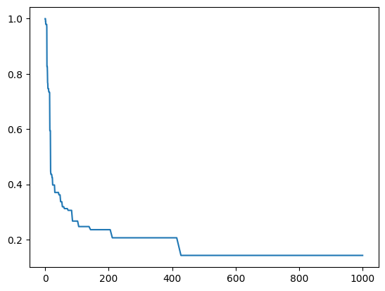

## *pymi* allows you to:

* calculate the MI (mutual information) and AMI (average mutual information) between each pair of bigram in a given corpus.

* plot sentences into trees based on the MI/AMI.

* segment sentences based on the MI/AMI.

* plot the mean number of word distribution for different thresholds of MI/AMI.


```python
# Install the dependencies:
# !pip install -r requirements.txt
```


```python
from pymi import PyMi
import seaborn as sns
```


```python
sentences = [
    ['i', 'enjoy', 'cooking', 'delicious', 'meals', 'for', 'my', 'friends', 'and', 'family'],
    ['colorless', 'green', 'sleeps', 'furiously'],
    ['the', 'sun', 'is', 'shining', 'brightly'],
    ['i', 'love', 'to', 'travel', 'and', 'explore', 'new', 'places'],
    ['music', 'makes', 'me', 'feel', 'alive'],
    ['coffee', 'is', 'my', 'go-to', 'morning', 'drink'],
    ['rainy', 'days', 'are', 'perfect', 'for', 'staying', 'in', 'and', 'reading', 'a', 'book'],
    ['hiking', 'in', 'the', 'mountains', 'is', 'a', 'great', 'way', 'to', 'unwind'],
    ['learning', 'new', 'things', 'is', 'always', 'exciting'],
    ['the', 'sound', 'of', 'waves', 'crashing', 'on', 'the', 'beach', 'is', 'so', 'soothing'],
    ['i', "can't", 'resist', 'a', 'good', 'piece', 'of', 'chocolate'],
    ['artistic', 'expression', 'is', 'a', 'beautiful', 'way', 'to', 'communicate'],
    ["i'm", 'always', 'up', 'for', 'a', 'fun', 'adventure'],
    ['the', 'smell', 'of', 'freshly', 'baked', 'bread', 'is', 'irresistible'],
    ['a', 'good', 'workout', 'can', 'boost', 'your', 'mood'],
    ['exploring', 'the', 'night', 'sky', 'with', 'a', 'telescope', 'is', 'fascinating'],
    ['spending', 'time', 'in', 'nature', 'recharges', 'my', 'energy'],
    ['singing', 'in', 'the', 'shower', 'is', 'my', 'guilty', 'pleasure'],
    ['i', 'believe', 'in', 'the', 'power', 'of', 'positive', 'thinking'],
    ['laughter', 'is', 'the', 'best', 'medicine'],
    ['helping', 'others', 'is', 'a', 'noble', 'pursuit'],
    ['dancing', 'is', 'a', 'great', 'way', 'to', 'express', 'yourself'],
    ['a', 'good', 'book', 'can', 'transport', 'you', 'to', 'another', 'world'],
    ['a', 'warm', 'cup', 'of', 'tea', 'is', 'perfect', 'for', 'a', 'cold', 'day'],
    ['i', 'enjoy', 'solving', 'challenging', 'puzzles'],
    ['animals', 'bring', 'joy', 'to', 'my', 'life'],
    ['traveling', 'allows', 'you', 'to', 'experience', 'different', 'cultures'],
    ['i', 'appreciate', 'the', 'beauty', 'of', 'a', 'starry', 'night'],
    ['meditation', 'helps', 'me', 'find', 'inner', 'peace'],
    ['spending', 'time', 'with', 'loved', 'ones', 'is', 'priceless'],
    ['learning', 'from', 'your', 'mistakes', 'is', 'important'],
    ['the', 'aroma', 'of', 'fresh', 'flowers', 'is', 'delightful'],
    ['i', 'find', 'solace', 'in', 'the', 'sound', 'of', 'a', 'babbling', 'brook'],
    ['challenges', 'make', 'us', 'stronger'],
    ['the', 'feeling', 'of', 'sand', 'between', 'your', 'toes', 'is', 'wonderful'],
    ['a', 'smile', 'can', 'brighten', "someone's", 'day'],
    ['i', 'believe', 'in', 'the', 'magic', 'of', 'the', 'universe'],
    ['sharing', 'a', 'meal', 'with', 'friends', 'is', 'a', 'special', 'moment'],
    ['learning', 'to', 'play', 'a', 'musical', 'instrument', 'is', 'fulfilling'],
    ['the', 'excitement', 'of', 'a', 'rollercoaster', 'ride', 'is', 'exhilarating'],
    ['kindness', 'is', 'a', 'virtue', 'we', 'should', 'all', 'practice'],
    ['watching', 'a', 'sunset', 'is', 'a', 'breathtaking', 'experience'],
    ['i', 'enjoy', 'the', 'thrill', 'of', 'a', 'good', 'mystery'],
    ['wandering', 'through', 'a', 'forest', 'is', 'a', 'tranquil', 'experience'],
    ['a', 'well-cooked', 'meal', 'is', 'a', 'work', 'of', 'art'],
    ['hugs', 'can', 'convey', 'more', 'than', 'words'],
    ['the', 'gentle', 'touch', 'of', 'a', 'loved', 'one', 'is', 'comforting'],
    ['a', 'good', 'movie', 'can', 'captivate', 'your', 'imagination'],
    ['candles', 'create', 'a', 'cozy', 'atmosphere']
]
```


```python
mi_model = PyMi(sentences, use_pickle=False)
```

    Getting bigrams...


    100%|██████████| 49/49 [00:00<00:00, 480189.01it/s]


    Getting word counts...


    100%|██████████| 49/49 [00:00<00:00, 662970.63it/s]


```python
mi_model.get_mi(['believe', 'in'])
```


    0.03662289713349294


```python
mi_model.sentence_to_tree(mi_model.documents[0], type_='ami').print()
```

                                                      _____.0097____                             
                                                     |              |                            
                  _________________________________.0207_         .0134_________                 
                 |                                       |       |              |                
        _______.0223_______________________             for     my         ___.0160_____         
       |                                   |                              |             |        
     .0518__                  ___________.0309__                       friends       _.0223___   
    |       |                |                  |                                   |         |  
    i     enjoy         ___.0309____          meals                                and     family
                       |            |                                                            
                    cooking     delicious                                                        


```python
mi_model.segment_sentence(mi_model.documents[0], type_='ami', threshold=.03, seg=' ')
```


    ['i enjoy', 'cooking delicious meals', 'for', 'my', 'friends', 'and', 'family']


```python
mi_model.sentence_to_tree(mi_model.documents[0], type_='mi').print()
```

         _______________________________________________________21.079_____                               
        |                                                                  |                              
     46.844_______________________________________________              42.159__________                  
    |                                                     |            |                |                 
    i               ___________________________________105.39_        my          ___70.266______         
                   |                                          |                  |               |        
              __140.53_________________________              for              friends        _140.53___   
             |                                 |                                            |          |  
           enjoy                 ___________421.59__                                       and      family
                                |                   |                                                     
                          ___421.59____           meals                                                   
                         |             |                                                                  
                      cooking      delicious                                                              


```python
mi_model.segment_sentence(mi_model.documents[0], type_='mi', threshold=140, seg=' ')
```


    ['i', 'enjoy cooking delicious meals', 'for', 'my', 'friends', 'and family']


```python
mi_model = PyMi('demo_docs_eng.pickle', use_pickle=True)
```

    Getting bigrams...


    100%|██████████| 49/49 [00:00<00:00, 660838.89it/s]


    Getting word counts...


    100%|██████████| 49/49 [00:00<00:00, 764018.20it/s]


```python
mi_model.save_mi_to_file(file_name='demo_docs_eng_mi_dic.pickle', type_='mi')
```

    Found existing mi file with 281 ngrams.


    0it [00:00, ?it/s]


```python
mi_model.mi_dic
```


    {('a', 'telescope'): 14.053270042194093,
     ('flowers', 'is'): 16.863924050632914,
     ('i', 'believe'): 46.84423347398032,
     ('to', 'experience'): 17.566587552742618,
     ('find', 'inner'): 210.7990506329114,
     ('staying', 'in'): 60.22830018083182,
     ('the', 'beach'): 23.42211673699016,
     ('of', 'positive'): 30.11415009041591,
     ('all', 'practice'): 421.5981012658228,
     ('for', 'my'): 21.07990506329114,
     ('thrill', 'of'): 30.11415009041591,
     ('mistakes', 'is'): 16.863924050632914,
     ('of', 'freshly'): 30.11415009041591,
     ('you', 'to'): 52.69976265822785,
     ('inner', 'peace'): 421.5981012658228,
     ('sunset', 'is'): 16.863924050632914,
     ('create', 'a'): 14.053270042194093,
     ('play', 'a'): 14.053270042194093,
     ('make', 'us'): 421.5981012658228,
     ('spending', 'time'): 210.7990506329114,
     ('a', 'noble'): 14.053270042194093,
     ('virtue', 'we'): 421.5981012658228,
     ('experience', 'different'): 140.53270042194094,
     ('excitement', 'of'): 30.11415009041591,
     ('wandering', 'through'): 421.5981012658228,
     ('a', 'babbling'): 14.053270042194093,
     ('enjoy', 'the'): 7.8073722456633865,
     ('animals', 'bring'): 421.5981012658228,
     ('always', 'up'): 210.7990506329114,
     ('of', 'tea'): 30.11415009041591,
     ('is', 'delightful'): 16.863924050632914,
     ('is', 'the'): 0.9368846694796062,
     ('musical', 'instrument'): 421.5981012658228,
     ('of', 'art'): 30.11415009041591,
     ('learning', 'to'): 17.566587552742618,
     ('of', 'chocolate'): 30.11415009041591,
     ('a', 'well-cooked'): 14.053270042194093,
     ('good', 'movie'): 84.31962025316456,
     ('sun', 'is'): 16.863924050632914,
     ('sleeps', 'furiously'): 421.5981012658228,
     ('friends', 'is'): 8.431962025316457,
     ('feel', 'alive'): 421.5981012658228,
     ('to', 'communicate'): 52.69976265822785,
     ('my', 'energy'): 84.31962025316456,
     ('warm', 'cup'): 421.5981012658228,
     ('the', 'sun'): 23.42211673699016,
     ('nature', 'recharges'): 421.5981012658228,
     ('us', 'stronger'): 421.5981012658228,
     ('a', 'smile'): 14.053270042194093,
     ('a', 'special'): 14.053270042194093,
     ('good', 'book'): 42.15981012658228,
     ('a', 'cold'): 14.053270042194093,
     ('touch', 'of'): 30.11415009041591,
     ('solving', 'challenging'): 421.5981012658228,
     ('ride', 'is'): 16.863924050632914,
     ('waves', 'crashing'): 421.5981012658228,
     ('the', 'universe'): 23.42211673699016,
     ('a', 'musical'): 14.053270042194093,
     ('sky', 'with'): 140.53270042194094,
     ('instrument', 'is'): 16.863924050632914,
     ('to', 'my'): 10.53995253164557,
     ('challenging', 'puzzles'): 421.5981012658228,
     ('the', 'aroma'): 23.42211673699016,
     ('freshly', 'baked'): 421.5981012658228,
     ('breathtaking', 'experience'): 140.53270042194094,
     ('can', 'brighten'): 84.31962025316456,
     ('shower', 'is'): 16.863924050632914,
     ('of', 'the'): 1.6730083383564396,
     ('with', 'friends'): 70.26635021097047,
     ('colorless', 'green'): 421.5981012658228,
     ('your', 'imagination'): 105.3995253164557,
     ('for', 'a'): 7.0266350210970465,
     ('is', 'shining'): 16.863924050632914,
     ('delicious', 'meals'): 421.5981012658228,
     ('meal', 'with'): 70.26635021097047,
     ('the', 'feeling'): 23.42211673699016,
     ('laughter', 'is'): 16.863924050632914,
     ('artistic', 'expression'): 421.5981012658228,
     ('toes', 'is'): 16.863924050632914,
     ('is', 'important'): 16.863924050632914,
     ('positive', 'thinking'): 421.5981012658228,
     ('brighten', "someone's"): 421.5981012658228,
     ('meditation', 'helps'): 421.5981012658228,
     ('my', 'guilty'): 84.31962025316456,
     ('others', 'is'): 16.863924050632914,
     ('smile', 'can'): 84.31962025316456,
     ('explore', 'new'): 210.7990506329114,
     ('of', 'fresh'): 30.11415009041591,
     ('a', 'good'): 14.053270042194097,
     ('great', 'way'): 140.53270042194094,
     ('enjoy', 'solving'): 140.53270042194094,
     ('good', 'workout'): 84.31962025316456,
     ('for', 'staying'): 105.3995253164557,
     ('feeling', 'of'): 30.11415009041591,
     ('a', 'loved'): 7.0266350210970465,
     ('cooking', 'delicious'): 421.5981012658228,
     ('way', 'to'): 52.699762658227854,
     ('through', 'a'): 14.053270042194093,
     ('in', 'the'): 16.7300833835644,
     ('music', 'makes'): 421.5981012658228,
     ('good', 'piece'): 84.31962025316456,
     ('days', 'are'): 421.5981012658228,
     ('i', "can't"): 46.84423347398032,
     ('i', 'love'): 46.84423347398032,
     ('a', 'beautiful'): 14.053270042194093,
     ('meal', 'is'): 8.431962025316457,
     ('gentle', 'touch'): 421.5981012658228,
     ('telescope', 'is'): 16.863924050632914,
     ('and', 'family'): 140.53270042194094,
     ('cup', 'of'): 30.11415009041591,
     ('cozy', 'atmosphere'): 421.5981012658228,
     ('expression', 'is'): 16.863924050632914,
     ('a', 'cozy'): 14.053270042194093,
     ('the', 'beauty'): 23.42211673699016,
     ('watching', 'a'): 14.053270042194093,
     ('is', 'comforting'): 16.863924050632914,
     ('is', 'wonderful'): 16.863924050632914,
     ('challenges', 'make'): 421.5981012658228,
     ('work', 'of'): 30.11415009041591,
     ('dancing', 'is'): 16.863924050632914,
     ('a', 'work'): 14.053270042194093,
     ('rollercoaster', 'ride'): 421.5981012658228,
     ('new', 'things'): 210.7990506329114,
     ('on', 'the'): 23.42211673699016,
     ('the', 'night'): 11.71105836849508,
     ('singing', 'in'): 60.22830018083182,
     ('the', 'best'): 23.42211673699016,
     ('transport', 'you'): 210.7990506329114,
     ('time', 'with'): 70.26635021097047,
     ('your', 'toes'): 105.3995253164557,
     ('new', 'places'): 210.7990506329114,
     ('enjoy', 'cooking'): 140.53270042194094,
     ('fun', 'adventure'): 421.5981012658228,
     ('book', 'can'): 42.15981012658228,
     ('good', 'mystery'): 84.31962025316456,
     ('sharing', 'a'): 14.053270042194093,
     ('tranquil', 'experience'): 140.53270042194094,
     ('your', 'mistakes'): 105.3995253164557,
     ('a', 'warm'): 14.053270042194093,
     ('believe', 'in'): 60.22830018083182,
     ('a', 'sunset'): 14.053270042194093,
     ('express', 'yourself'): 421.5981012658228,
     ('my', 'go-to'): 84.31962025316456,
     ('to', 'another'): 52.69976265822785,
     ('can', 'captivate'): 84.31962025316456,
     ('a', 'tranquil'): 14.053270042194093,
     ('things', 'is'): 16.863924050632914,
     ('can', 'transport'): 84.31962025316456,
     ('a', 'meal'): 7.0266350210970465,
     ('a', 'starry'): 14.053270042194093,
     ('hiking', 'in'): 60.22830018083182,
     ('different', 'cultures'): 421.5981012658228,
     ('of', 'waves'): 30.11415009041591,
     ('is', 'fascinating'): 16.863924050632914,
     ('my', 'life'): 84.31962025316456,
     ('another', 'world'): 421.5981012658228,
     ('i', 'find'): 23.42211673699016,
     ('go-to', 'morning'): 421.5981012658228,
     ('in', 'and'): 20.076100060277277,
     ('beautiful', 'way'): 140.53270042194094,
     ('starry', 'night'): 210.7990506329114,
     ('with', 'a'): 4.684423347398032,
     ('the', 'thrill'): 23.42211673699016,
     ('is', 'perfect'): 8.431962025316457,
     ('a', 'rollercoaster'): 14.053270042194093,
     ('is', 'my'): 6.745569620253166,
     ('the', 'power'): 23.42211673699016,
     ('workout', 'can'): 84.31962025316456,
     ('a', 'breathtaking'): 14.053270042194093,
     ('we', 'should'): 421.5981012658228,
     ("someone's", 'day'): 210.7990506329114,
     ('a', 'book'): 7.0266350210970465,
     ('piece', 'of'): 30.11415009041591,
     ('fresh', 'flowers'): 421.5981012658228,
     ('best', 'medicine'): 421.5981012658228,
     ('perfect', 'for'): 105.3995253164557,
     ('helps', 'me'): 210.7990506329114,
     ('me', 'feel'): 210.7990506329114,
     ('the', 'mountains'): 23.42211673699016,
     ('always', 'exciting'): 210.7990506329114,
     ('bread', 'is'): 16.863924050632914,
     ('boost', 'your'): 105.3995253164557,
     ('are', 'perfect'): 210.7990506329114,
     ('is', 'so'): 16.863924050632914,
     ('solace', 'in'): 60.22830018083182,
     ('a', 'virtue'): 14.053270042194093,
     ('should', 'all'): 421.5981012658228,
     ('recharges', 'my'): 84.31962025316456,
     ('from', 'your'): 105.3995253164557,
     ('the', 'smell'): 23.42211673699016,
     ('beach', 'is'): 16.863924050632914,
     ("can't", 'resist'): 421.5981012658228,
     ('and', 'explore'): 140.53270042194094,
     ('appreciate', 'the'): 23.42211673699016,
     ('is', 'fulfilling'): 16.863924050632914,
     ("i'm", 'always'): 210.7990506329114,
     ('convey', 'more'): 421.5981012658228,
     ('i', 'enjoy'): 46.84423347398032,
     ('to', 'unwind'): 52.69976265822785,
     ('find', 'solace'): 210.7990506329114,
     ('a', 'forest'): 14.053270042194093,
     ('a', 'great'): 14.053270042194093,
     ('traveling', 'allows'): 421.5981012658228,
     ('reading', 'a'): 14.053270042194093,
     ('well-cooked', 'meal'): 210.7990506329114,
     ('candles', 'create'): 421.5981012658228,
     ('morning', 'drink'): 421.5981012658228,
     ('sand', 'between'): 421.5981012658228,
     ('power', 'of'): 30.11415009041591,
     ('aroma', 'of'): 30.11415009041591,
     ('travel', 'and'): 140.53270042194094,
     ('coffee', 'is'): 16.863924050632914,
     ('is', 'always'): 8.431962025316457,
     ('meals', 'for'): 105.3995253164557,
     ('shining', 'brightly'): 421.5981012658228,
     ('is', 'a'): 5.059177215189874,
     ('the', 'magic'): 23.42211673699016,
     ('a', 'fun'): 14.053270042194093,
     ('green', 'sleeps'): 421.5981012658228,
     ('can', 'boost'): 84.31962025316456,
     ('sound', 'of'): 30.11415009041591,
     ('guilty', 'pleasure'): 421.5981012658228,
     ('tea', 'is'): 16.863924050632914,
     ('learning', 'from'): 140.53270042194094,
     ('me', 'find'): 105.3995253164557,
     ('captivate', 'your'): 105.3995253164557,
     ('the', 'sound'): 23.42211673699016,
     ('my', 'friends'): 42.15981012658228,
     ('learning', 'new'): 70.26635021097047,
     ('resist', 'a'): 14.053270042194093,
     ('to', 'play'): 52.69976265822785,
     ('forest', 'is'): 16.863924050632914,
     ('up', 'for'): 105.3995253164557,
     ('friends', 'and'): 70.26635021097047,
     ('ones', 'is'): 16.863924050632914,
     ('joy', 'to'): 52.69976265822785,
     ('and', 'reading'): 140.53270042194094,
     ('your', 'mood'): 105.3995253164557,
     ('beauty', 'of'): 30.11415009041591,
     ('so', 'soothing'): 421.5981012658228,
     ('magic', 'of'): 30.11415009041591,
     ('the', 'excitement'): 23.42211673699016,
     ('is', 'exhilarating'): 16.863924050632914,
     ('can', 'convey'): 84.31962025316456,
     ('the', 'gentle'): 23.42211673699016,
     ('helping', 'others'): 421.5981012658228,
     ('of', 'sand'): 30.11415009041591,
     ('baked', 'bread'): 421.5981012658228,
     ('with', 'loved'): 70.26635021097047,
     ('in', 'nature'): 60.22830018083182,
     ('of', 'a'): 5.019025015069319,
     ('babbling', 'brook'): 421.5981012658228,
     ('one', 'is'): 16.863924050632914,
     ('night', 'sky'): 210.7990506329114,
     ('more', 'than'): 421.5981012658228,
     ('hugs', 'can'): 84.31962025316456,
     ('than', 'words'): 421.5981012658228,
     ('rainy', 'days'): 421.5981012658228,
     ('movie', 'can'): 84.31962025316456,
     ('bring', 'joy'): 421.5981012658228,
     ('the', 'shower'): 23.42211673699016,
     ('is', 'priceless'): 16.863924050632914,
     ('loved', 'one'): 210.7990506329114,
     ('crashing', 'on'): 421.5981012658228,
     ('i', 'appreciate'): 46.84423347398032,
     ('exploring', 'the'): 23.42211673699016,
     ('love', 'to'): 52.69976265822785,
     ('kindness', 'is'): 16.863924050632914,
     ('makes', 'me'): 210.7990506329114,
     ('smell', 'of'): 30.11415009041591,
     ('noble', 'pursuit'): 421.5981012658228,
     ('between', 'your'): 105.3995253164557,
     ('mountains', 'is'): 16.863924050632914,
     ('allows', 'you'): 210.7990506329114,
     ('cold', 'day'): 210.7990506329114,
     ('to', 'express'): 52.69976265822785,
     ('loved', 'ones'): 210.7990506329114,
     ('special', 'moment'): 421.5981012658228,
     ('is', 'irresistible'): 16.863924050632914,
     ('to', 'travel'): 52.69976265822785,
     ('time', 'in'): 30.11415009041591}


```python
distribution = mi_model.get_distribution(0, 1000, type_='mi')
```

    threshold:1000.0; word percentage:last––0.1424382307035368 this––0.1424382307035368: 100%|██████████| 150/150 [00:00<00:00, 2586.93it/s]  


```python
sns.lineplot(
    x=distribution['threshold'],
    y=distribution['mean_word_percentage']
)
```


    <Axes: >


    

    

